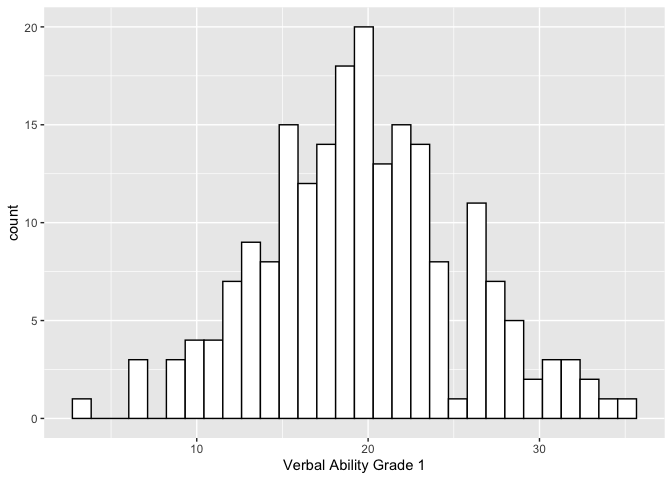
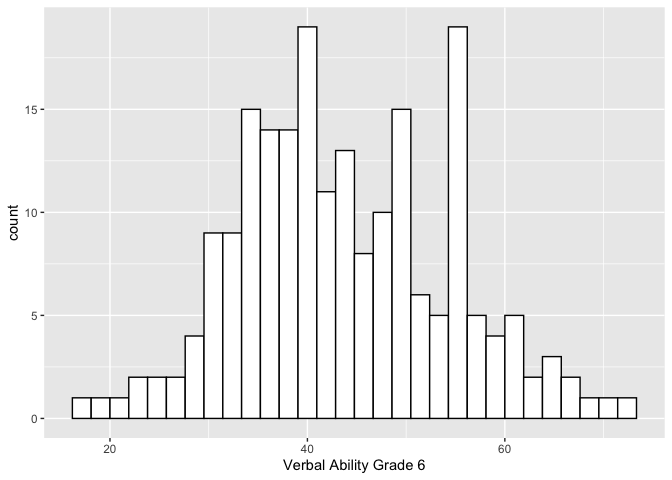
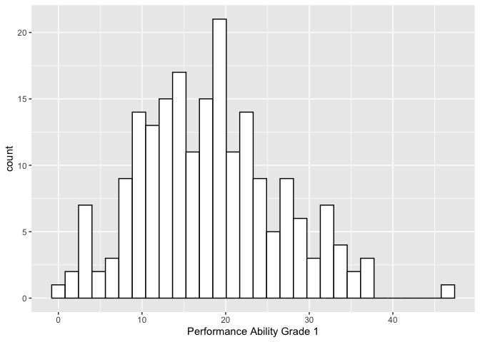
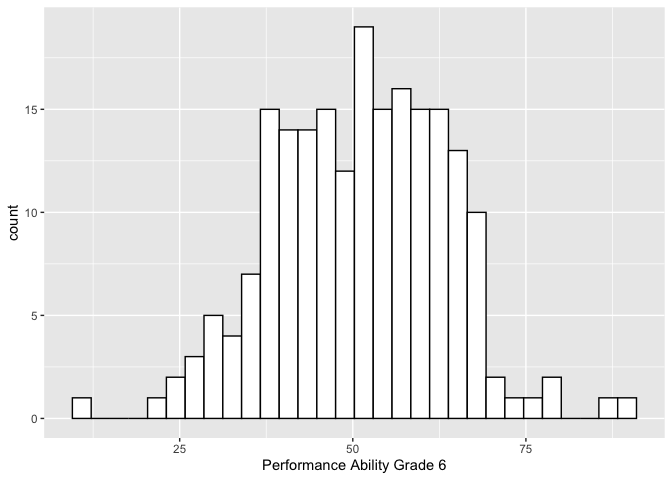
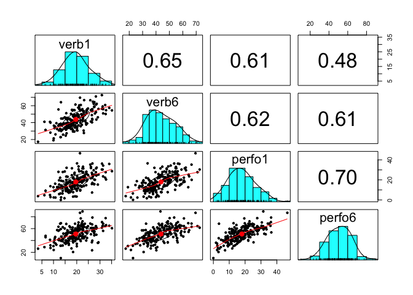
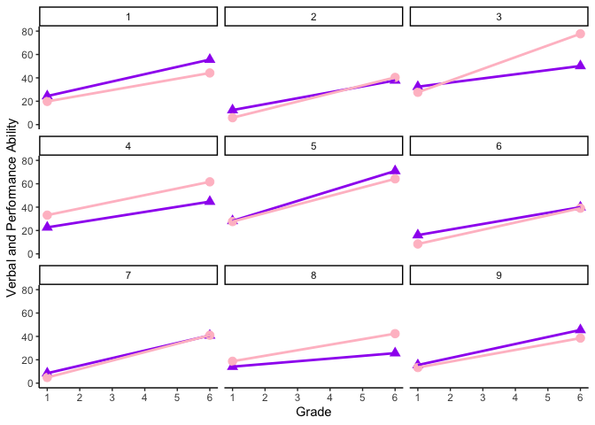

Actor-Partner Interdependence Model (APIM)
================
Miriam Brinberg

# Overview

This tutorial reviews the Actor-Partner Interdependence Model (APIM;
Kashy & Kenny, 2000; Kenny, Kashy, & Cook, 2006), which is often used to
examine the association (1) between two constructs for two people using
cross-sectional data, or (2) between the same construct from two people
across two time points.

# Outline

In this tutorial, we’ll cover…

  - Useful descriptive statistics for dyadic data
  - Dyadic data preparation
  - APIM model using `nlme` package
  - Other resources

Before we begin, let’s load the libraries we need.

``` r
library(ggplot2)
library(nlme)
library(psych)
library(reshape)
```

We’ll be using our trusty WISC data, so we’ll read that data set in.

``` r
#set filepath for data file
filepath <- "https://quantdev.ssri.psu.edu/sites/qdev/files/wisc3raw_gender.csv"

#read in the .csv file using the url() function
wisc3raw <- read.csv(file=url(filepath),header=TRUE)

#subset to variables of interest
data <- wisc3raw[, c("id", "verb1", "verb6", "perfo1", "perfo6")]
head(data)
```

    ##   id verb1 verb6 perfo1 perfo6
    ## 1  1 24.42 55.64  19.84  44.19
    ## 2  2 12.44 37.81   5.90  40.38
    ## 3  3 32.43 50.18  27.64  77.72
    ## 4  4 22.69 44.72  33.16  61.66
    ## 5  5 28.23 70.95  27.64  64.22
    ## 6  6 16.06 39.94   8.45  39.08

We’ll also make a long version of the data set for later use.

``` r
data_long <- reshape(data = data,
                    varying = c("verb1", "verb6",
                                "perfo1", "perfo6"),
                    timevar = c("grade"), 
                    idvar = c("id"),
                    direction = "long", sep="")

#sort for easy viewing - reorder by id and grade
data_long <- data_long[order(data_long$id, data_long$grade), ]
```

# Problem Definition

In this tutorial, we are going to examine the association between verbal
and performance ability using measures from first grade and sixth grade.
We are interested in simultaneously examining whether (1) verbal ability
in the first grade is predictive of verbal ability in the sixth grade,
(2) performance ability in the first grade is predictive of performance
ability in the sixth grade, (3) verbal ability in the first grade is
predictive of performance ability in the sixth grade, and (4)
performance ability in the first grade is predictive of verbal ability
in the sixth grade.

When working with people, the above points 1 and 2 are often referred to
as “actor effects” and points 3 and 4 are often referred to as “partner
effects.”

While this example is not a “traditional” dyad - i.e., two
distinguishable people - the analytic processes demonstrated here are
applicable to the examination of any bivariate relationship.

# Descriptive Statistics for Dyadic Data

Before we run our models, it is often useful to get more familiar with
the data via plotting and descriptive statistics.

Let’s begin with descriptive statistics of our four variables of
interest: first grade verbal and performance ability, and sixth grade
verbal and performance
    ability.

``` r
describe(data$verb1)
```

    ##    vars   n  mean   sd median trimmed  mad  min   max range skew kurtosis   se
    ## X1    1 204 19.59 5.81  19.34    19.5 5.41 3.33 35.15 31.82 0.13    -0.05 0.41

``` r
describe(data$verb6)
```

    ##    vars   n  mean    sd median trimmed  mad   min   max range skew kurtosis
    ## X1    1 204 43.75 10.67  42.55   43.46 11.3 17.35 72.59 55.24 0.24    -0.36
    ##      se
    ## X1 0.75

``` r
describe(data$perfo1)
```

    ##    vars   n  mean   sd median trimmed mad min   max range skew kurtosis   se
    ## X1    1 204 17.98 8.35  17.66   17.69 8.3   0 46.58 46.58 0.35    -0.11 0.58

``` r
describe(data$perfo6)
```

    ##    vars   n  mean    sd median trimmed   mad   min   max range  skew kurtosis
    ## X1    1 204 50.93 12.48  51.77   51.07 13.27 10.26 89.01 78.75 -0.06     0.18
    ##      se
    ## X1 0.87

We can see that both the mean and standard deviation of verbal and
performance ability increase from first to sixth grade. While this is
worth noting, the APIM will not be examining changes in mean differences
of verbal and performance ability.

And we’ll plot the distributions of each of these variables as well.

``` r
ggplot(data = data, aes(x = verb1)) +
  geom_histogram(fill = "white", color = "black") + 
  labs(x = "Verbal Ability Grade 1") 
```

<!-- -->

``` r
ggplot(data = data, aes(x = verb6)) +
  geom_histogram(fill = "white", color = "black") + 
  labs(x = "Verbal Ability Grade 6") 
```

<!-- -->

``` r
ggplot(data = data, aes(x = perfo1)) +
  geom_histogram(fill = "white", color = "black") + 
  labs(x = "Performance Ability Grade 1") 
```

<!-- -->

``` r
ggplot(data = data, aes(x = perfo6)) +
  geom_histogram(fill = "white", color = "black") + 
  labs(x = "Performance Ability Grade 6") 
```

<!-- -->

Next, let’s examine the association (i.e., rank order stability) among
each variable of interest using correlations and a plot.

``` r
#correlations
cor(data[, 2:5])
```

    ##            verb1     verb6    perfo1    perfo6
    ## verb1  1.0000000 0.6541040 0.6101379 0.4779672
    ## verb6  0.6541040 1.0000000 0.6183155 0.6106694
    ## perfo1 0.6101379 0.6183155 1.0000000 0.6958321
    ## perfo6 0.4779672 0.6106694 0.6958321 1.0000000

``` r
#plot
pairs.panels(data[, c("verb1", "verb6", "perfo1", "perfo6")])
```

<!-- -->

We can see there are strong, positive associations both across time and
constructs.

Let’s also look at a few individuals to examine the within-person
association between verbal and performance ability from the first to
sixth
grade.

``` r
ggplot(data = subset(data_long, id <= 9), aes(x = grade, group = id), legend = FALSE) +
  geom_point(aes(x = grade, y = verb), shape = 17, size = 3, color = "purple") + 
  geom_point(aes(x = grade, y = perfo), shape = 19, size = 3, color = "pink") + 
  geom_line(aes(x = grade, y = verb), lty = 1, size=1, color = "purple") + 
  geom_line(aes(x = grade, y = perfo), lty = 1, size=1, color = "pink") + 
  xlab("Grade") + 
  ylab("Verbal and Performance Ability") + ylim(0, 80) +
  scale_x_continuous(breaks=seq(0, 7, by = 1)) + 
  theme_classic() +
  facet_wrap( ~ id)
```

<!-- -->

Within these nine participants, there is some inter-individual
variability. For example, some participants’ verbal and performance
ability increases more drastically than others, some participants have
higher levels of verbal ability than performance ability (or vice versa)
across time.

# Dyadic data preparation

We have learned to manipulate data from “wide” to “long,” and vice
versa. Dyadic/bivariate analyses require further manipulation in order
to get the data in the correct format for our analyses. We will walk
through the data prep in two steps.

First, we need to create one column that has the information for both
outcome variables - i.e., for each person, the verb6 and perfo6 values
will alternate. This is almost like repeated measures data, but instead
of having multiple time points nested within person, we have multiple
(two) variables to nest within person.

``` r
data_melt <- reshape::melt(data = data,
                      id.vars = c("id", "verb1", "perfo1"),
                      na.rm=FALSE)
head(data_melt)
```

    ##   id verb1 perfo1 variable value
    ## 1  1 24.42  19.84    verb6 55.64
    ## 2  2 12.44   5.90    verb6 37.81
    ## 3  3 32.43  27.64    verb6 50.18
    ## 4  4 22.69  33.16    verb6 44.72
    ## 5  5 28.23  27.64    verb6 70.95
    ## 6  6 16.06   8.45    verb6 39.94

``` r
#rename "variable" and "value" variables to "grade6_variable" and "grade6_outcome"
colnames(data_melt)[4:5] <- c("grade6_variable", "grade6_outcome")

#re-order for convenience
data_melt <- data_melt[order(data_melt$id, data_melt$grade6_variable), ]

#look at updated data set
head(data_melt)
```

    ##     id verb1 perfo1 grade6_variable grade6_outcome
    ## 1    1 24.42  19.84           verb6          55.64
    ## 205  1 24.42  19.84          perfo6          44.19
    ## 2    2 12.44   5.90           verb6          37.81
    ## 206  2 12.44   5.90          perfo6          40.38
    ## 3    3 32.43  27.64           verb6          50.18
    ## 207  3 32.43  27.64          perfo6          77.72

Second, we need to create two dummy variables (each 0/1) that will be
useful in our analyses to “turn on/off” a row (more on this later). We
will create one column that assigns the first row of the double entry
data to 1, and we’ll call this “verb\_on.” We will create another column
that assigns the second row of the double entry data to 1, and we’ll
call this “perform\_on.”

``` r
data_melt$verb_on <- rep(c(1,0), times = (nrow(data_melt)/2))
data_melt$perform_on <- rep(c(0,1), times = (nrow(data_melt)/2))

head(data_melt)
```

    ##     id verb1 perfo1 grade6_variable grade6_outcome verb_on perform_on
    ## 1    1 24.42  19.84           verb6          55.64       1          0
    ## 205  1 24.42  19.84          perfo6          44.19       0          1
    ## 2    2 12.44   5.90           verb6          37.81       1          0
    ## 206  2 12.44   5.90          perfo6          40.38       0          1
    ## 3    3 32.43  27.64           verb6          50.18       1          0
    ## 207  3 32.43  27.64          perfo6          77.72       0          1

Please note that this data preparation is probably *not* the most
elegant way to organize the data. There are alternative ways one could
prepare your data
(<https://github.com/RandiLGarcia/2day-dyad-workshop/blob/master/Day%201/R%20Code/Day%201-Data%20Restructuring.Rmd>),
but it will depend on how you choose to run your analysis (described
further later).

# APIM using `nlme` package

Now that we know a bit more about the data we are working with and have
the data prepared in an usable format, we can set up our APIM model.
We’ll run this model in the `nlme` package.

Specifically, we’ll examine whether:

  - verbal ability in the first grade is predictive of verbal ability in
    the sixth grade (verbal “actor” effect),  
  - performance ability in the first grade is predictive of performance
    ability in the sixth grade (performance “actor” effect),  
  - verbal ability in the first grade is predictive of performance
    ability in the sixth grade (verbal “partner” effect), and  
  - performance ability in the first grade is predictive of verbal
    ability in the sixth grade (performance “partner” effect).

Before running this full model, we will examine the empty model to
determine how much variability there is within- and between-persons.
Specifically,

  
  

Empty
model.

``` r
apim_empty <- gls(grade6_outcome ~  -1 +               #makes sure no intercept is estimated
                                 verb_on +             #intercept for verbal scores
                                 perform_on,           #intercept for performance scores
               data = data_melt,
               correlation = corCompSymm(form=~1|id),
               weights = varIdent(form=~1|verb_on),    #allows for different error terms for the two variables
               na.action = na.exclude)

summary(apim_empty)
```

    ## Generalized least squares fit by REML
    ##   Model: grade6_outcome ~ -1 + verb_on + perform_on 
    ##   Data: data_melt 
    ##        AIC      BIC    logLik
    ##   3063.861 3083.893 -1526.931
    ## 
    ## Correlation Structure: Compound symmetry
    ##  Formula: ~1 | id 
    ##  Parameter estimate(s):
    ##       Rho 
    ## 0.6106684 
    ## Variance function:
    ##  Structure: Different standard deviations per stratum
    ##  Formula: ~1 | verb_on 
    ##  Parameter estimates:
    ##        1        0 
    ## 1.000000 1.170165 
    ## 
    ## Coefficients:
    ##               Value Std.Error t-value p-value
    ## verb_on    43.74990 0.7467026 58.5908       0
    ## perform_on 50.93162 0.8737656 58.2898       0
    ## 
    ##  Correlation: 
    ##            verb_n
    ## perform_on 0.611 
    ## 
    ## Standardized residuals:
    ##         Min          Q1         Med          Q3         Max 
    ## -3.25897805 -0.72994548 -0.02108776  0.72003021  3.05118458 
    ## 
    ## Residual standard error: 10.66505 
    ## Degrees of freedom: 408 total; 406 residual

We examine the correlation of the verbal and performance error terms to
determine the degree of non-independence in the data. We can see that
Rho = 0.61, indicating the correlation across dyad members, children who
have higher verbal ability have higher performance ability.

Other things to note in this output…

  - The results for “verb\_on” indicate the average or expected verbal
    score at grade 6 is 43.75.  

  - The results for “perform\_on” indicate the average or expected
    performance score at grade 6 is 50.93.

  - Both of these expected values correspond to their respective
    averages in the raw data.

  - The verbal and performance scores each have their own estimated
    error values. The estimated standard error for verbal scores is
    10.67 and the estimated standard error for performance scores is
    12.48 (1.17\*10.67).

Next, we are going to run our full APIM model using the two-intercept
approach. Specifically,

  
  

So when “verb\_on” is equal to 0:

  
  

and when “perform\_on” is equal to 0:

  
  

Full
model.

``` r
apim_full <- gls(grade6_outcome ~  -1 +               #makes sure no intercept is estimated
                                 verb_on +
                                 perform_on +
                                 verb1:verb_on +     #verbal "actor" effect
                                 perfo1:perform_on + #performance "actor" effect
                                 verb1:perform_on +  #verbal "partner" effect
                                 perfo1:verb_on,     #performance "partner" effect
               data = data_melt,
               correlation = corCompSymm(form=~1|id),
               weights = varIdent(form=~1|verb_on), #allows for different error terms for the two variables
               na.action = na.exclude)

summary(apim_full)
```

    ## Generalized least squares fit by REML
    ##   Model: grade6_outcome ~ -1 + verb_on + perform_on + verb1:verb_on +      perfo1:perform_on + verb1:perform_on + perfo1:verb_on 
    ##   Data: data_melt 
    ##        AIC      BIC    logLik
    ##   2879.029 2914.997 -1430.514
    ## 
    ## Correlation Structure: Compound symmetry
    ##  Formula: ~1 | id 
    ##  Parameter estimate(s):
    ##       Rho 
    ## 0.3116371 
    ## Variance function:
    ##  Structure: Different standard deviations per stratum
    ##  Formula: ~1 | verb_on 
    ##  Parameter estimates:
    ##        1        0 
    ## 1.000000 1.188537 
    ## 
    ## Coefficients:
    ##                       Value Std.Error   t-value p-value
    ## verb_on           19.869325 1.8634458 10.662679  0.0000
    ## perform_on        30.049124 2.2147737 13.567582  0.0000
    ## verb_on:verb1      0.809886 0.1150893  7.037017  0.0000
    ## perform_on:perfo1  0.962419 0.0951429 10.115507  0.0000
    ## perform_on:verb1   0.182846 0.1367879  1.336709  0.1821
    ## verb_on:perfo1     0.446064 0.0800504  5.572292  0.0000
    ## 
    ##  Correlation: 
    ##                   verb_n prfrm_ vrb_n:v1 prfrm_n:p1 prfrm_n:v1
    ## perform_on         0.312                                      
    ## verb_on:verb1     -0.738 -0.230                               
    ## perform_on:perfo1 -0.011 -0.034 -0.190                        
    ## perform_on:verb1  -0.230 -0.738  0.312   -0.610               
    ## verb_on:perfo1    -0.034 -0.011 -0.610    0.312     -0.190    
    ## 
    ## Standardized residuals:
    ##         Min          Q1         Med          Q3         Max 
    ## -2.55877989 -0.66034374 -0.02441614  0.62804538  3.69258918 
    ## 
    ## Residual standard error: 7.545255 
    ## Degrees of freedom: 408 total; 402 residual

Let’s interpret the results\!

  - The expected verbal score at grade 6 = 19.87 and the expected
    performance score at grade 6 = 30.05 when verbal and performance
    scores at grade 1 are equal to zero.

  - Actor effects:
    
      - The “actor effect” of verbal ability is 0.81, indicating that a
        child’s verbal ability increases by 0.81 points for every
        additional point in their grade 1 verbal ability score.  
      - The “actor effect” of performance ability is 0.96, indicating
        that a child’s performance ability increases by 0.96 points for
        every additional point in their grade 1 performance ability
        score.

  - Partner effects:
    
      - The “partner effect” of performance ability on verbal ability is
        0.45, indicating that a child’s verbal ability increases by 0.45
        points for every additional point in their grade 1 performance
        ability score.  
      - The “partner effect” of verbal ability on performance ability is
        not significant, indicating that a child’s performance ability
        at grade 1 is not associated with their verbal ability at grade
        6.

  - Other things to note:
    
      - Rho = 0.31, indicating that indicating the correlation across
        dyad members, children who have higher verbal ability have
        higher performance ability.
      - The verbal and performance scores each have their own estimated
        error values. The estimated standard error for verbal scores is
        7.55 and the estimated standard error for performance scores is
        8.98 (1.19\*7.55).

# Other resources

We’ve walked through one way of running an APIM model in R - however,
there are alternative ways of doing so. Here are a few resources if
you’d like to learn more about running an APIM model or dyadic data
analyses in general.

  - David Kenny’s website, where he and his colleagues have created some
    useful shiny apps for running dyadic analyses in R:
    <http://davidakenny.net/DyadR/DyadRweb.htm>
  - Randi Garcia’s github page: <https://github.com/RandiLGarcia>
  - Another QuantDev tutorial for repeated measures dyadic data:
    <https://quantdev.ssri.psu.edu/sites/qdev/files/ILD_Ch05_2017_DyadicMLM.html>
