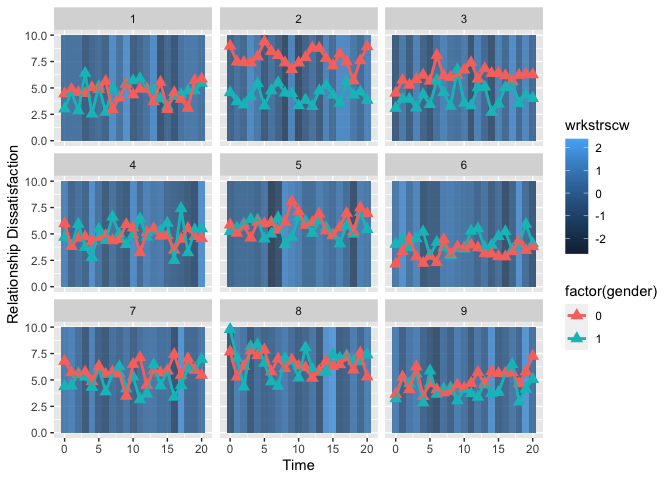

Dyadic Multilevel Model for Examining Intradyad Covariation
================
Miriam Brinberg

## Overview

Repeated measures data, often obtained from experience sampling or daily
diary studies, require analytic methods that accommodate the inherent
nesting in the data. One special case of repeated measures data are
those from dyad (e.g., couples, parent/child). Dyadic data is structured
such that repeated measures are nested within a person, and each person
is nested within a dyad. The dyads are assumed to be independently
sampled. Non-independece of the members of the dyad and across the
repeated occasions are modeled explicitly. *Multivariate multilevel
modeling* is one technique for effectively handling this type of data.
Formal names for the dayad-specific model include *Actor Partner
Interdependence Model (APIM)* (see Kenny, Kashy, & Cook, 2006).

In this tutorial, we will follow the example from Bolger and Laurenceau
(2013) *Chapter 8: Design and Analysis of Intensive Longitudinal
Longitudinal Study of Distingiushable Dyads.* Specifically, we will use
the simulated dyadic process data set (p. 150). The data were simulated
to represent 100 dual-career heterosexual couples where each partner
provided diary reports twice daily over the course of 21 consecutive
days. The first report is an end-of-workday report that includes (a) the
number of stressors that occurred at work, and (b) work dissatisfaction.
The data are complete and clean - with Bolger and Laurenceau’s goal
being to “create a pedagologically uncomplicated data set.”

Note that we are using *distinguishable* dyads in this example.
*Distinguishability* is typically determined conceptually, based upon a
stable, differentiating characteristic (e.g., gender, age, role). Note
that notions of “dyadic” can be generalized from persons to any
reasonable combination of two variables (e.g., emotion and behavior).
The next tutorial will illustrate application of the multivariate
multilevel model for examination of intraindividual coupling.

## Outline

1.  Introduction to the research questions, model, and data.
2.  Plotting the data.
3.  The multilevel model.
      - Males only.
      - Females only.
      - The dyad.
4.  Cautions.
5.  Conclusion.

#### Prelim - Loading libraries used in this script.

``` r
library(ggplot2)
library(nlme)
library(psych)
```

## 1\. Introduction to the Research Questions, Model, and Data.

### The Research Questions.

We are going to address:

  - Is the number of daily work stressors associated with end-of-day
    relationship satisfaction?
      - What is the extent of association for the *typical male partner*
        and for the *typical female partner* (fixed effects)?
      - Is there heterogeneity in the strength of the association across
        male partners in couples and across female partners in couples
        (random effects)?

Notice that, so far, the questions are stated separately for the two
types of dyad members (males and females). The dyadic longitudinal model
provides for another type of question - questions related to
non-independence.

  - Are dyad members’ relationship satisfaction on any given day
    related, after accounting for other explanatory variables?

Here, these relations manifest as correlations/covariances between
intercepts, slopes, and residuals.

### The Modeling Enterprise.

The basic multilevel model is designed as a model with a univariate
outcome. The ability to model multiple outcomes simultaneoulsy used to
be a distinguishing feature of structural equation models (SEM).
However, researches discovered that the multilevel model can be adapted
for examination of multivariate outcomes quite easily. One simply has to
“trick” the program into thinking that two (or more) variables are one
variable.

### The Data.

The data are organized as follows:

  - There should be *N* (number of individuals) x measurement occasions
    rows per dyad in the data set. In this case, we should have a data
    set with 4,200 rows (100 dyads x 2 persons x 21 occasions).

  - Columns:
    
      - Couple ID
    
      - Person ID (e.g., 1 = partner 1, 2 = partner 2)
    
      - Time (e.g., day within the daily diary study)
    
      - Centered version of time (optional)
    
      - Gender (or whatever feature is distinguishing the dyad; in this
        case, 0 = male and 1 = female)
    
      - An indicator variable for each partner (e.g., husband, wife) -
        dichotomous (0/1)
    
      - Outcome variable (in this case, “reldis”)
    
      - Predictor variable (in this case, “wrkstrs”)
    
      - Centered version of the predictor variable (“wrkstrsc”)
    
      - Trait component of the predictor variable (“wrkstrsb”)
    
      - State component of the predictor variable (“wrkstrsw”)
    
      - for a total of 12 columns in this data set

The “trick” is to stack the data so that there are two records for each
repeated observation. The data file is twice as long, and we structure
the model to “turn on” and “turn off” the double records to invoke
parameter estimation for each variable. Bolger & Laurenceau’s example
data are already prepared data. Let’s take a look.

Load data and needed libraries.

``` r
# Set filepath for data file
filepath <- "https://quantdev.ssri.psu.edu/sites/qdev/files/B%26Ldyads.csv"

# Read in the .csv file using the url() function
dyads <- read.csv(file=url(filepath),header=TRUE)

# Look at the variable names
names(dyads)
```

    ##  [1] "coupleid"  "personid"  "time"      "time7c"    "gender"    "female"   
    ##  [7] "male"      "reldis"    "wrkstrs"   "wrkstrsc"  "wrkstrscb" "wrkstrscw"

``` r
# Re-ordering for easy viewing
dyads <- dyads[order(dyads$coupleid, dyads$time, dyads$personid),]

# Examine first few rows of the data set
head(dyads)
```

    ##    coupleid personid time    time7c gender female male reldis wrkstrs  wrkstrsc
    ## 1         1        1    0 -1.500000      1      1    0   3.03       3 0.0095238
    ## 22        1        2    0 -1.500000      0      0    1   4.46       3 0.0095238
    ## 2         1        1    1 -1.357143      1      1    0   4.62       3 0.0095238
    ## 23        1        2    1 -1.357143      0      0    1   4.88       3 0.0095238
    ## 3         1        1    2 -1.214286      1      1    0   2.85       3 0.0095238
    ## 24        1        2    2 -1.214286      0      0    1   4.58       3 0.0095238
    ##     wrkstrscb wrkstrscw
    ## 1  -0.3238095 0.3333333
    ## 22 -0.1333333 0.1428571
    ## 2  -0.3238095 0.3333333
    ## 23 -0.1333333 0.1428571
    ## 3  -0.3238095 0.3333333
    ## 24 -0.1333333 0.1428571

## 2\. Plotting the Data.

Before we begin running our models, it is always a good idea to look at
our data.

We start with examining the distribution of our outcome variable
end-of-day relationship dissatisfaction, `reldis`. Let’s look at the
histogram by gender.

``` r
ggplot(data = dyads, aes(x = reldis)) +
  geom_histogram(fill = "white", color = "black") + 
  labs(x = "Relationship Dissatisfaction") +
  facet_grid(. ~ gender) # creating a separate plot for each gender
```

<!-- -->

The outcome variable for each gender looks approximately normally
distributed, which is good news for when we run our models.

Next, let’s plot a few dyads’ reports of relationship dissatisfaction
through the course of the study. Since the the predictor variable has
already been split into time-varying (state) and time-invariant (trait)
components, we use the time-varying predictor `wrkstrscw` as the
“background” context
variable.

``` r
ggplot(data = subset(dyads, coupleid <= 9), aes(x = time, group = personid), legend = FALSE) +
  geom_rect(mapping = aes(xmin = time-.5, xmax = time+.5, ymin = 0, ymax = 10, fill = wrkstrscw), alpha = 0.6) + # creating rectangles in the background of the plot colored by work stressors
  geom_point(aes(x = time, y = reldis, color = factor(gender)), shape = 17, size = 3) + # creating a different colored point for each gender
  geom_line(aes(x = time, y = reldis, color = factor(gender)), lty = 1, size=1) + # creating a different colored line for each gender
  xlab("Time") + 
  ylab("Relationship Dissatisfaction") + ylim(0, 10) +
  scale_x_continuous(breaks=seq(0, 20, by = 5)) + 
  facet_wrap( ~ coupleid) # creating a separate plot for each dyad
```

<!-- -->

It looks like there is quite a lot of day-to-day variability\!

Finally, we’ll examine a histogram of the dyad-level (between-dyad)
time-invariant variable is `wrkstrscb`

``` r
ggplot(data = dyads, aes(x = wrkstrscb)) +
  geom_histogram(fill = "white", color = "black") + 
  labs(x = "Work Stress (dyad-level centered)")
```

<!-- -->

## 3\. The Multilevel Model.

We are now ready to start running our models\!

First, we’ll construct a model looking at the within-person and
between-person associations of relationship dissatisfaction (`reldis`)
with work stressors (`wrkstrs` - which is centered and separated into
`wrkstrscw` and `wrkdstrscb`).

This multilevel model set-up proceeds as usual; however, we will include
a special “dummy” variable indicator as follows:

  
  

with two random effects, so that   
  

  
  

  
  

and residual structures of where   
")  
, and   
")  
.

where   
![\\mathbf{R} =
\\mathbf{I}
\\left\[\\begin{array}
{r}
\\sigma^2\_{e} 
\\end{array}\\right\]](https://latex.codecogs.com/png.latex?%5Cmathbf%7BR%7D%20%3D%0A%5Cmathbf%7BI%7D%0A%5Cleft%5B%5Cbegin%7Barray%7D%0A%7Br%7D%0A%5Csigma%5E2_%7Be%7D%20%20%0A%5Cend%7Barray%7D%5Cright%5D
"\\mathbf{R} =
\\mathbf{I}
\\left[\\begin{array}
{r}
\\sigma^2_{e}  
\\end{array}\\right]")  

, which with the auto-regressive structure becomes   
![\\mathbf{R} =
\\sigma^2
\\left\[\\begin{array}
{rrrr}
1 & \\phi & \\phi^2 & \\cdots & \\phi^{T-1} \\\\
\\phi & 1 & \\phi & \\cdots & \\phi^{T-2} \\\\
\\phi^2 & \\phi & 1 & \\cdots & \\phi^{T-3} \\\\
\\vdots & \\vdots & \\vdots & \\ddots & \\vdots \\\\
\\phi^{T-1} & \\phi^{T-2} & \\phi^{T-3} & \\cdots & 1
\\end{array}\\right\]](https://latex.codecogs.com/png.latex?%5Cmathbf%7BR%7D%20%3D%0A%5Csigma%5E2%0A%5Cleft%5B%5Cbegin%7Barray%7D%0A%7Brrrr%7D%0A1%20%26%20%5Cphi%20%26%20%5Cphi%5E2%20%26%20%5Ccdots%20%26%20%5Cphi%5E%7BT-1%7D%20%5C%5C%0A%5Cphi%20%26%201%20%26%20%5Cphi%20%26%20%5Ccdots%20%26%20%5Cphi%5E%7BT-2%7D%20%5C%5C%0A%5Cphi%5E2%20%26%20%5Cphi%20%26%201%20%26%20%5Ccdots%20%26%20%5Cphi%5E%7BT-3%7D%20%5C%5C%0A%5Cvdots%20%20%26%20%5Cvdots%20%20%26%20%5Cvdots%20%26%20%5Cddots%20%26%20%5Cvdots%20%5C%5C%0A%5Cphi%5E%7BT-1%7D%20%26%20%5Cphi%5E%7BT-2%7D%20%26%20%5Cphi%5E%7BT-3%7D%20%26%20%5Ccdots%20%26%201%0A%5Cend%7Barray%7D%5Cright%5D
"\\mathbf{R} =
\\sigma^2
\\left[\\begin{array}
{rrrr}
1 & \\phi & \\phi^2 & \\cdots & \\phi^{T-1} \\\\
\\phi & 1 & \\phi & \\cdots & \\phi^{T-2} \\\\
\\phi^2 & \\phi & 1 & \\cdots & \\phi^{T-3} \\\\
\\vdots  & \\vdots  & \\vdots & \\ddots & \\vdots \\\\
\\phi^{T-1} & \\phi^{T-2} & \\phi^{T-3} & \\cdots & 1
\\end{array}\\right]")  

and the between-person residuals structure is   
![\\mathbf{G} =
\\left\[\\begin{array}
{rr}
\\sigma^{2}\_{u0} & \\sigma\_{u0u2} \\\\
\\sigma\_{u2u0} & \\sigma^{2}\_{u2}
\\end{array}\\right\]](https://latex.codecogs.com/png.latex?%5Cmathbf%7BG%7D%20%3D%0A%5Cleft%5B%5Cbegin%7Barray%7D%0A%7Brr%7D%0A%5Csigma%5E%7B2%7D_%7Bu0%7D%20%26%20%5Csigma_%7Bu0u2%7D%20%5C%5C%0A%5Csigma_%7Bu2u0%7D%20%26%20%5Csigma%5E%7B2%7D_%7Bu2%7D%0A%5Cend%7Barray%7D%5Cright%5D
"\\mathbf{G} =
\\left[\\begin{array}
{rr}
\\sigma^{2}_{u0} & \\sigma_{u0u2} \\\\
\\sigma_{u2u0} & \\sigma^{2}_{u2}
\\end{array}\\right]")  

Writing out the long equation (after algebraic substitution) we have

  
![reldis\_{it} = \\\\
\\gamma\_{00}dummy\_{it} + \\gamma\_{10}dummy\_{it}time7c\_{it}+
\\gamma\_{20}dummy\_{it}wrkstrscw\_{it} +
\\gamma\_{01}dummy\_{it}wrkstrscb\_{i} + \\\\
\\left\[ u\_{0i}dummy\_{it} + u\_{2i}dummy\_{it}wrkstrscw\_{it} +
e\_{it}
\\right\]](https://latex.codecogs.com/png.latex?reldis_%7Bit%7D%20%3D%20%5C%5C%0A%5Cgamma_%7B00%7Ddummy_%7Bit%7D%20%20%2B%20%5Cgamma_%7B10%7Ddummy_%7Bit%7Dtime7c_%7Bit%7D%2B%20%5Cgamma_%7B20%7Ddummy_%7Bit%7Dwrkstrscw_%7Bit%7D%20%2B%20%5Cgamma_%7B01%7Ddummy_%7Bit%7Dwrkstrscb_%7Bi%7D%20%2B%20%5C%5C%0A%5Cleft%5B%20u_%7B0i%7Ddummy_%7Bit%7D%20%2B%20u_%7B2i%7Ddummy_%7Bit%7Dwrkstrscw_%7Bit%7D%20%2B%20e_%7Bit%7D%20%5Cright%5D
"reldis_{it} = \\\\
\\gamma_{00}dummy_{it}  + \\gamma_{10}dummy_{it}time7c_{it}+ \\gamma_{20}dummy_{it}wrkstrscw_{it} + \\gamma_{01}dummy_{it}wrkstrscb_{i} + \\\\
\\left[ u_{0i}dummy_{it} + u_{2i}dummy_{it}wrkstrscw_{it} + e_{it} \\right]")  

which then is the equation that maps to the `lme()` or `lmer()`
code.

#### First, we run the model for just males. Although not necessary, we use the  variable `male`.

*Note also the coding to remove the default intercept* `~ -1 ...` *and
for direct specification of interaction terms using colon* `x:z` **This
is important.** *We are tricking the program, so we have to be very
specific about what we want.*

``` r
model0male <- lme(fixed = reldis ~ -1 + male + male:time7c + 
                          male:wrkstrscw + male:wrkstrscb,
                  random = ~ -1 + male + male:wrkstrscw | coupleid, 
                  correlation = corAR1(), # specifying an lag-1 autoregressive residual structure
                  data = dyads[which(dyads$gender == 0),], # subsetting to just male
                  control = list(maxIter = 1000)) 

summary(model0male)
```

    ## Linear mixed-effects model fit by REML
    ##  Data: dyads[which(dyads$gender == 0), ] 
    ##        AIC      BIC    logLik
    ##   5806.776 5857.606 -2894.388
    ## 
    ## Random effects:
    ##  Formula: ~-1 + male + male:wrkstrscw | coupleid
    ##  Structure: General positive-definite, Log-Cholesky parametrization
    ##                StdDev    Corr 
    ## male           1.0152924 male 
    ## male:wrkstrscw 0.1703982 0.188
    ## Residual       0.8726433      
    ## 
    ## Correlation Structure: AR(1)
    ##  Formula: ~1 | coupleid 
    ##  Parameter estimate(s):
    ##        Phi 
    ## 0.01691436 
    ## Fixed effects: reldis ~ -1 + male + male:time7c + male:wrkstrscw + male:wrkstrscb 
    ##                    Value Std.Error   DF  t-value p-value
    ## male            5.083091 0.1038703 1998 48.93689  0.0000
    ## male:time7c     0.011701 0.0225726 1998  0.51835  0.6043
    ## male:wrkstrscw  0.109507 0.0257084 1998  4.25958  0.0000
    ## male:wrkstrscb -0.027946 0.4552738   98 -0.06138  0.9512
    ##  Correlation: 
    ##                male   ml:tm7 ml:wrkstrscw
    ## male:time7c     0.015                    
    ## male:wrkstrscw  0.122 -0.004             
    ## male:wrkstrscb -0.098  0.002 -0.004      
    ## 
    ## Standardized Within-Group Residuals:
    ##          Min           Q1          Med           Q3          Max 
    ## -3.374483094 -0.641886672  0.001625504  0.648554761  3.000192639 
    ## 
    ## Number of Observations: 2100
    ## Number of Groups: 100

We see that the average relationship dissatisfaction for males was 5.08.
There were significant “state” effects, such that on days when a man had
one more work stressor than usual, his relationship dissatisfaction
increased by 0.11 points. There were no significant trends with time or
significant “trait” level
effects.

#### Second, we run the model for just females, with the  variable `female`.

``` r
model0female <- lme(fixed = reldis ~ -1 + female + female:time7c + 
                          female:wrkstrscw + female:wrkstrscb,
                  random = ~ -1 + female + female:wrkstrscw | coupleid, 
                  correlation=corAR1(), # specifying an lag-1 autoregressive residual structure
                  data=dyads[which(dyads$gender == 1),], # subsetting to just female
                  control=list(maxIter=1000)) 

summary(model0female)
```

    ## Linear mixed-effects model fit by REML
    ##  Data: dyads[which(dyads$gender == 1), ] 
    ##        AIC      BIC    logLik
    ##   6303.436 6354.266 -3142.718
    ## 
    ## Random effects:
    ##  Formula: ~-1 + female + female:wrkstrscw | coupleid
    ##  Structure: General positive-definite, Log-Cholesky parametrization
    ##                  StdDev    Corr  
    ## female           0.9613730 female
    ## female:wrkstrscw 0.1271923 0.481 
    ## Residual         0.9978968       
    ## 
    ## Correlation Structure: AR(1)
    ##  Formula: ~1 | coupleid 
    ##  Parameter estimate(s):
    ##         Phi 
    ## 0.002610472 
    ## Fixed effects: reldis ~ -1 + female + female:time7c + female:wrkstrscw + female:wrkstrscb 
    ##                      Value Std.Error   DF  t-value p-value
    ## female            4.650787 0.0991035 1998 46.92859  0.0000
    ## female:time7c    -0.023380 0.0253670 1998 -0.92168  0.3568
    ## female:wrkstrscw  0.158532 0.0253158 1998  6.26216  0.0000
    ## female:wrkstrscb  0.762574 0.4453133   98  1.71244  0.0900
    ##  Correlation: 
    ##                  female fml:t7 fml:wrkstrscw
    ## female:time7c     0.018                     
    ## female:wrkstrscw  0.234 -0.014              
    ## female:wrkstrscb  0.101 -0.001 -0.003       
    ## 
    ## Standardized Within-Group Residuals:
    ##          Min           Q1          Med           Q3          Max 
    ## -3.256748606 -0.648814252 -0.008317617  0.650836522  3.379549729 
    ## 
    ## Number of Observations: 2100
    ## Number of Groups: 100

We see that the average relationship dissatisfaction for females was
4.65. There were significant “state” effects, such that on days when a
woman had one more work stressor than usual, her relationship
dissatisfaction increased by 0.16 points. There were no significant
trends with time or significant “trait” level effects.

#### Third, we combine the two models together examining the dyad.

As above, we use the two dummy variables to turn on and off the
parameters. The parameters invoked with
 are
associated with one member of the dyad, and parameters invoked with
 are
associated with the other member of the dyad.

  
![reldis\_{it} = \\\\
\\gamma\_{00}dummy1\_{it} + \\gamma\_{10}dummy1\_{it}time7c\_{it}+
\\gamma\_{20}dummy1\_{it}wrkstrscw\_{it} +
\\gamma\_{01}dummy1\_{it}wrkstrscb\_{i} + \\left\[ u\_{0i}dummy1\_{it} +
u\_{2i}dummy1\_{it}wrkstrscw\_{it} + e1\_{it} \\right\] + \\\\
\\gamma\_{30}dummy2\_{it} + \\gamma\_{40}dummy2\_{it}time7c\_{it}+
\\gamma\_{50}dummy2\_{it}wrkstrscw\_{it} +
\\gamma\_{31}dummy2\_{it}wrkstrscb\_{i} + \\left\[ u\_{3i}dummy2\_{it} +
u\_{5i}dummy2\_{it}wrkstrscw\_{it} + e2\_{it}
\\right\]](https://latex.codecogs.com/png.latex?reldis_%7Bit%7D%20%3D%20%5C%5C%0A%5Cgamma_%7B00%7Ddummy1_%7Bit%7D%20%20%2B%20%5Cgamma_%7B10%7Ddummy1_%7Bit%7Dtime7c_%7Bit%7D%2B%20%5Cgamma_%7B20%7Ddummy1_%7Bit%7Dwrkstrscw_%7Bit%7D%20%2B%20%5Cgamma_%7B01%7Ddummy1_%7Bit%7Dwrkstrscb_%7Bi%7D%20%2B%20%5Cleft%5B%20u_%7B0i%7Ddummy1_%7Bit%7D%20%2B%20u_%7B2i%7Ddummy1_%7Bit%7Dwrkstrscw_%7Bit%7D%20%2B%20e1_%7Bit%7D%20%5Cright%5D%20%2B%20%5C%5C%0A%5Cgamma_%7B30%7Ddummy2_%7Bit%7D%20%20%2B%20%5Cgamma_%7B40%7Ddummy2_%7Bit%7Dtime7c_%7Bit%7D%2B%20%5Cgamma_%7B50%7Ddummy2_%7Bit%7Dwrkstrscw_%7Bit%7D%20%2B%20%5Cgamma_%7B31%7Ddummy2_%7Bit%7Dwrkstrscb_%7Bi%7D%20%2B%20%5Cleft%5B%20u_%7B3i%7Ddummy2_%7Bit%7D%20%2B%20u_%7B5i%7Ddummy2_%7Bit%7Dwrkstrscw_%7Bit%7D%20%2B%20e2_%7Bit%7D%20%5Cright%5D
"reldis_{it} = \\\\
\\gamma_{00}dummy1_{it}  + \\gamma_{10}dummy1_{it}time7c_{it}+ \\gamma_{20}dummy1_{it}wrkstrscw_{it} + \\gamma_{01}dummy1_{it}wrkstrscb_{i} + \\left[ u_{0i}dummy1_{it} + u_{2i}dummy1_{it}wrkstrscw_{it} + e1_{it} \\right] + \\\\
\\gamma_{30}dummy2_{it}  + \\gamma_{40}dummy2_{it}time7c_{it}+ \\gamma_{50}dummy2_{it}wrkstrscw_{it} + \\gamma_{31}dummy2_{it}wrkstrscb_{i} + \\left[ u_{3i}dummy2_{it} + u_{5i}dummy2_{it}wrkstrscw_{it} + e2_{it} \\right]")  

Noting that our random effect matrices also expand,   
![\\mathbf{R} =
\\left\[\\begin{array}
{rr}
\\sigma^2\_{e1} & \\sigma\_{e1e2} \\\\
\\sigma\_{e1e2} & \\sigma^2\_{e2} 
\\end{array}\\right\]](https://latex.codecogs.com/png.latex?%5Cmathbf%7BR%7D%20%3D%0A%5Cleft%5B%5Cbegin%7Barray%7D%0A%7Brr%7D%0A%5Csigma%5E2_%7Be1%7D%20%26%20%5Csigma_%7Be1e2%7D%20%5C%5C%0A%5Csigma_%7Be1e2%7D%20%26%20%5Csigma%5E2_%7Be2%7D%20%0A%5Cend%7Barray%7D%5Cright%5D
"\\mathbf{R} =
\\left[\\begin{array}
{rr}
\\sigma^2_{e1} & \\sigma_{e1e2} \\\\
\\sigma_{e1e2} & \\sigma^2_{e2} 
\\end{array}\\right]")  

where
 is the residual covariance between male and female
relationship dissatisfaction.  
and   
![\\left\[\\begin{array}
{rrrr}
\\sigma^{2}\_{u0} & \\sigma\_{u0u2} & \\sigma\_{u0u3} & \\sigma\_{u0u5}
\\\\
\\sigma\_{u2u0} & \\sigma^{2}\_{u2} & \\sigma\_{u2u3} & \\sigma\_{u2u5}
\\\\
\\sigma\_{u3u0} & \\sigma\_{u3u2} & \\sigma^{2}\_{u3} & \\sigma\_{u3u5}
\\\\
\\sigma\_{u5u0} & \\sigma\_{u5u2} & \\sigma\_{u5u3} & \\sigma^{2}\_{u5}
\\end{array}\\right\]](https://latex.codecogs.com/png.latex?%5Cleft%5B%5Cbegin%7Barray%7D%0A%7Brrrr%7D%0A%5Csigma%5E%7B2%7D_%7Bu0%7D%20%26%20%5Csigma_%7Bu0u2%7D%20%26%20%5Csigma_%7Bu0u3%7D%20%26%20%5Csigma_%7Bu0u5%7D%20%5C%5C%0A%5Csigma_%7Bu2u0%7D%20%26%20%5Csigma%5E%7B2%7D_%7Bu2%7D%20%26%20%5Csigma_%7Bu2u3%7D%20%26%20%5Csigma_%7Bu2u5%7D%20%5C%5C%0A%5Csigma_%7Bu3u0%7D%20%26%20%5Csigma_%7Bu3u2%7D%20%26%20%5Csigma%5E%7B2%7D_%7Bu3%7D%20%26%20%5Csigma_%7Bu3u5%7D%20%5C%5C%0A%5Csigma_%7Bu5u0%7D%20%26%20%5Csigma_%7Bu5u2%7D%20%26%20%5Csigma_%7Bu5u3%7D%20%26%20%5Csigma%5E%7B2%7D_%7Bu5%7D%0A%5Cend%7Barray%7D%5Cright%5D
"\\left[\\begin{array}
{rrrr}
\\sigma^{2}_{u0} & \\sigma_{u0u2} & \\sigma_{u0u3} & \\sigma_{u0u5} \\\\
\\sigma_{u2u0} & \\sigma^{2}_{u2} & \\sigma_{u2u3} & \\sigma_{u2u5} \\\\
\\sigma_{u3u0} & \\sigma_{u3u2} & \\sigma^{2}_{u3} & \\sigma_{u3u5} \\\\
\\sigma_{u5u0} & \\sigma_{u5u2} & \\sigma_{u5u3} & \\sigma^{2}_{u5}
\\end{array}\\right]")  

where the matrix is blocks of between-dyad associations, some among
males only, some among females anly, and some across genders. *These are
sample-level, between-dyad relations, and should be interpreted
appropriately.*

``` r
model1 <- lme(fixed = reldis ~ -1 + 
                          male + male:time7c + 
                          male:wrkstrscw + male:wrkstrscb + 
                          female + female:time7c + 
                          female:wrkstrscw + female:wrkstrscb,
                  random = ~ -1 + 
                            male + male:wrkstrscw + 
                            female + female:wrkstrscw | coupleid, 
                  weights=varIdent(form = ~1 | gender), # this invokes separate sigma^{2}_{e} for each gender
                  corr=corCompSymm(form = ~1 | coupleid/time), # this invokes the off-diaginal sigma_{e1e2} 
                  data=dyads,
                  control=list(maxIter=1000)) 

summary(model1)
```

    ## Linear mixed-effects model fit by REML
    ##  Data: dyads 
    ##        AIC      BIC    logLik
    ##   12096.16 12229.31 -6027.078
    ## 
    ## Random effects:
    ##  Formula: ~-1 + male + male:wrkstrscw + female + female:wrkstrscw | coupleid
    ##  Structure: General positive-definite, Log-Cholesky parametrization
    ##                  StdDev    Corr                
    ## male             1.0157904 male   female ml:wrk
    ## female           0.9600378  0.263              
    ## male:wrkstrscw   0.1678949  0.178 -0.019       
    ## wrkstrscw:female 0.1250147  0.007  0.485  0.502
    ## Residual         0.9981039                     
    ## 
    ## Correlation Structure: Compound symmetry
    ##  Formula: ~1 | coupleid/time 
    ##  Parameter estimate(s):
    ##        Rho 
    ## 0.07320729 
    ## Variance function:
    ##  Structure: Different standard deviations per stratum
    ##  Formula: ~1 | gender 
    ##  Parameter estimates:
    ##        1        0 
    ## 1.000000 0.873824 
    ## Fixed effects: reldis ~ -1 + male + male:time7c + male:wrkstrscw + male:wrkstrscb +      female + female:time7c + female:wrkstrscw + female:wrkstrscb 
    ##                      Value Std.Error   DF  t-value p-value
    ## male              5.085720 0.1038242 4093 48.98396  0.0000
    ## female            4.647561 0.0989240 4093 46.98114  0.0000
    ## male:time7c       0.011615 0.0222292 4093  0.52251  0.6013
    ## male:wrkstrscw    0.109398 0.0255077 4093  4.28885  0.0000
    ## male:wrkstrscb   -0.141904 0.4388417 4093 -0.32336  0.7464
    ## time7c:female    -0.024921 0.0252926 4093 -0.98532  0.3245
    ## wrkstrscw:female  0.159484 0.0251352 4093  6.34507  0.0000
    ## wrkstrscb:female  0.623306 0.4276929 4093  1.45737  0.1451
    ##  Correlation: 
    ##                  male   female ml:tm7 ml:wrkstrscw ml:wrkstrscb tm7c:f
    ## female            0.253                                               
    ## male:time7c       0.015  0.001                                        
    ## male:wrkstrscw    0.115 -0.012 -0.004                                 
    ## male:wrkstrscb   -0.095 -0.003  0.002 -0.004                          
    ## time7c:female     0.001  0.018  0.071 -0.001        0.001             
    ## wrkstrscw:female  0.003  0.234  0.001  0.163        0.001       -0.014
    ## wrkstrscb:female  0.003  0.097  0.000  0.001       -0.029       -0.002
    ##                  wrkstrscw:
    ## female                     
    ## male:time7c                
    ## male:wrkstrscw             
    ## male:wrkstrscb             
    ## time7c:female              
    ## wrkstrscw:female           
    ## wrkstrscb:female -0.004    
    ## 
    ## Standardized Within-Group Residuals:
    ##           Min            Q1           Med            Q3           Max 
    ## -3.3784814575 -0.6500702594  0.0004839748  0.6501003829  3.3326567187 
    ## 
    ## Number of Observations: 4200
    ## Number of Groups: 100

*Note that the residual structure is not quite the same as in Bolger &
Laurenceau (2013).* It is not clear exactly how to get `lme()` structure
to match. There is not a straightforward way, but it seems like it is
possible. We just haven’t found the exact combination of structures to
use yet.

But, here is another close variant.

``` r
model2 <- lme(fixed = reldis ~ -1 + 
                          male + male:time7c + 
                          male:wrkstrscw + male:wrkstrscb + 
                          female + female:time7c + 
                          female:wrkstrscw + female:wrkstrscb,
                  random = ~ -1 + 
                            male + male:wrkstrscw + 
                            female + female:wrkstrscw | coupleid, 
                  weights=varIdent(form = ~1 | gender), # this invokes separate sigma^{2}_{e} for each gender
                  corr=corAR1(form = ~1 | coupleid/gender/time), # this invokes an AR structure
                  data=dyads,
                  control=list(maxIter=1000)) 

summary(model2)
```

    ## Linear mixed-effects model fit by REML
    ##  Data: dyads 
    ##        AIC      BIC    logLik
    ##   12106.53 12239.69 -6032.266
    ## 
    ## Random effects:
    ##  Formula: ~-1 + male + male:wrkstrscw + female + female:wrkstrscw | coupleid
    ##  Structure: General positive-definite, Log-Cholesky parametrization
    ##                  StdDev    Corr                
    ## male             1.0157826 male   female ml:wrk
    ## female           0.9600367  0.267              
    ## male:wrkstrscw   0.1675384  0.191 -0.004       
    ## wrkstrscw:female 0.1287722  0.012  0.470  0.506
    ## Residual         0.8722334                     
    ## 
    ## Correlation Structure: AR(1)
    ##  Formula: ~1 | coupleid/gender/time 
    ##  Parameter estimate(s):
    ## Phi 
    ##   0 
    ## Variance function:
    ##  Structure: Different standard deviations per stratum
    ##  Formula: ~1 | gender 
    ##  Parameter estimates:
    ##        0        1 
    ## 1.000000 1.143872 
    ## Fixed effects: reldis ~ -1 + male + male:time7c + male:wrkstrscw + male:wrkstrscb +      female + female:time7c + female:wrkstrscw + female:wrkstrscb 
    ##                      Value Std.Error   DF  t-value p-value
    ## male              5.085736 0.1038230 4093 48.98468  0.0000
    ## female            4.647385 0.0989235 4093 46.97960  0.0000
    ## male:time7c       0.011710 0.0222300 4093  0.52678  0.5984
    ## male:wrkstrscw    0.108935 0.0255201 4093  4.26858  0.0000
    ## male:wrkstrscb   -0.142334 0.4385224 4093 -0.32458  0.7455
    ## time7c:female    -0.024775 0.0252913 4093 -0.97960  0.3273
    ## wrkstrscw:female  0.160824 0.0253763 4093  6.33757  0.0000
    ## wrkstrscb:female  0.614992 0.4283572 4093  1.43570  0.1512
    ##  Correlation: 
    ##                  male   female ml:tm7 ml:wrkstrscw ml:wrkstrscb tm7c:f
    ## female            0.253                                               
    ## male:time7c       0.015  0.000                                        
    ## male:wrkstrscw    0.123 -0.002 -0.004                                 
    ## male:wrkstrscb   -0.095 -0.003  0.002 -0.005                          
    ## time7c:female     0.000  0.018 -0.001 -0.001        0.001             
    ## wrkstrscw:female  0.006  0.231  0.001  0.168        0.001       -0.014
    ## wrkstrscb:female  0.003  0.097  0.000  0.001       -0.029       -0.001
    ##                  wrkstrscw:
    ## female                     
    ## male:time7c                
    ## male:wrkstrscw             
    ## male:wrkstrscb             
    ## time7c:female              
    ## wrkstrscw:female           
    ## wrkstrscb:female -0.003    
    ## 
    ## Standardized Within-Group Residuals:
    ##          Min           Q1          Med           Q3          Max 
    ## -3.379097672 -0.647627754  0.001645522  0.654334289  3.321512475 
    ## 
    ## Number of Observations: 4200
    ## Number of Groups: 100

Although the structure is not exactly matched to the example in the
book, the ones we are fitting are among the structures used in the
literature. Across variants, the interpretations do not change in
meaningful ways, suggesting that looking across the range of
possibilites is fine.

#### Brief Interpretation.

The results for the dyadic model are similar to when the models for
males and females were run separately; however, this will not always be
the case.

**Fixed effects:** On an average day, males and females relationship
dissatisfaction is 5.08 and 4.65, respectively, on a 0 to 10 scale. On
days when there is an additional work stressor that usual, relationship
dissatisfaction increases by 0.11 and 0.16 for males and females,
respectively.

**Random effects:** The deviation around males and females average
relationship dissatisfaction is 1.02 and 0.96, respectively.
Additionally, males and females relationship dissatisfaction reports are
correlated 0.27, indicating that members of the same dyad often have
relatively similar reports of relationship dissatisfaction. The
deviation around males and females reactivity to work stressors (i.e.,
slope of work stressors) is 0.17 and 0.13, respectively. The way in
which dyad members’ relationship dissatisfaction changes in response to
work stressors is quite similar, as indicated by the 0.51 correlation.

A more thorough interpretation and formal write-up of the results can be
found on pages 165 - 171 of Bolger and Laurenceau (2013) *Chapter 8:
Design and Analysis of Intensive Longitudinal Longitudinal Study of
Distingiushable Dyads.*

## 4\. Cautions.

While we only provide a brief description of the multivariate multilevel
model for repeated measures dyadic data, we want to a highlight a few
consierations when using this model.

1.  The model used here is for *distinguishable* dyads. The persons
    within each dyad are separated (and pooled) according to an a priori
    defined feature (e.g., gender, role).
2.  The model used here examined the *linear* association between work
    stressors and relationship dissatisfaction. Different formualtions
    are needed to test for non-linear relations.
3.  Mdel inferences should be done carefully, keeping in mind that that
    level 2 covariances are between-individual covariances.

## 5\. Conclusion.

This tutorial is meant to accompany the example provided in *Chapter 8:
Design and Analysis of Intensive Longitudinal Longitudinal Study of
Distingiushable Dyads* of Bolger and Laurenceau (2013). We provided
brief explanation of (1) the underlying model, (2) the code to run these
models in R, and (3) the interpretation of the results. More detailed
information about these (and related analyses) can be found in Bolger
and Laurenceau (2013), Laurenceau and Bolger (2005), and Kenny, Kashy,
and Cook (2006).
