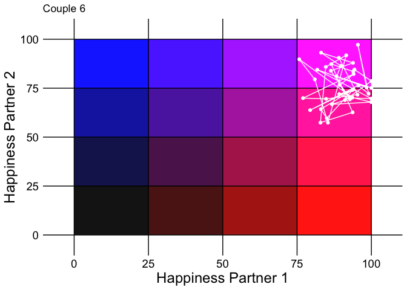
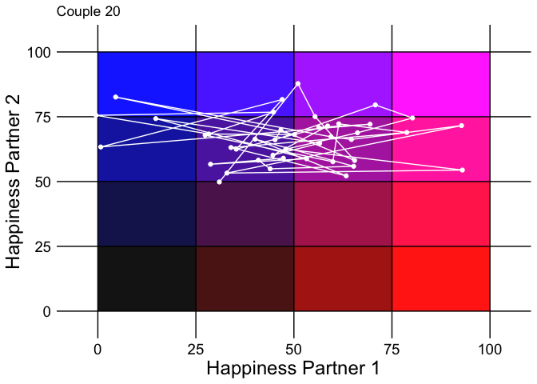
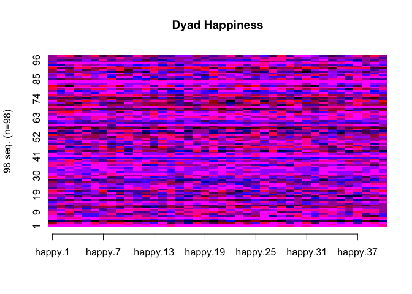
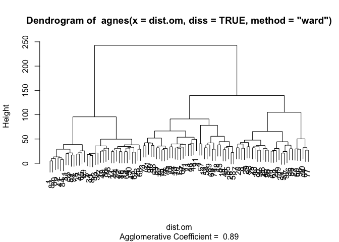
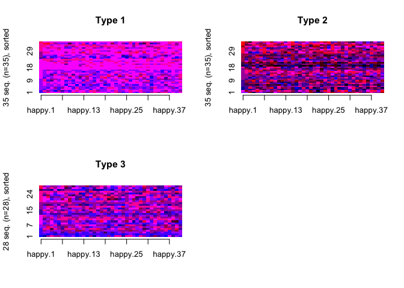

Grid-Sequence Analysis Tutorial
================
Miriam Brinberg

## Overview

Grid-sequence analysis utilizes repeated-measures dyadic data to examine
within-dyad processes and between-dyad differences. To read more about
grid-sequence analysis see:

Brinberg, M., Fosco, G.M., & Ram, N. (2017). Examining inter-family
differences in intra-family (parent-adolescent) dynamics using
grid-sequence analysis. *Journal of Family Psychology, 31*(8), 994-1004.
doi: 10.1037/fam0000371

Brinberg, M., Ram, N., Hülür, G., Brick, T.R., & Gerstorf, D. (2018).
Analyzing dyadic data using grid-sequence analysis: Inter-dyad
differences in intra-dyad dynamics. *Journals of Gerontology:
Psychological Sciences, 73*(1), 5-18. doi: 10.1093/geronb/gbw160

## Outline

0.  Introduction to Grid-Sequence Analysis.
1.  Create State-Space Grids for Each Dyad.
2.  Create Sequences.
3.  Establish a Cost Matrix and Sequence Analysis.
4.  Cluster Determination.
5.  Examine Group Differences among Clusters.

## 0\. Introduction to Grid-Sequence Analysis.

Grid-sequence analysis is a descriptive technique to capture within-dyad
dynamics and allow for between-dyad comparisons. This analytic technique
draws from state-space grids, typically used in developmental psychology
(Hollenstein, 2013) and sequence analysis, previously used in sociology
and biology (Macindoe & Abbott, 2004).

Grid-sequence analysis combines state-space grids and sequence analysis
by:

1.  Tracking a dyad’s movements across a grid.
2.  Converting dyad movements into a univariate sequence.
3.  Clustering dyads with similar movements using sequence analysis.

Before we begin, let’s load the libraries we need and data we are going
to use.

``` r
library(cluster)        #for cluster analysis
library(ggplot2)        #for plotting
library(reshape)        #for reshaping the data (long to wide)
library(TraMineR)       #for sequence analysis
library(TraMineRextras) #for sequence analysis
```

Load the data.

``` r
# Set filepath for repeated measures data file
filepath <- "https://quantdev.ssri.psu.edu/sites/qdev/files/gridsequence_simulation_data.csv"

# Read in the .csv file using the url() function
data <- read.csv(file = url(filepath), header = TRUE)

# Delete first column of data 
data[1] <- NULL
head(data)
```

    ##   id time1  outcome1  outcome2
    ## 1  1     1  88.27175 100.00000
    ## 2  1     2  93.70530  88.49227
    ## 3  1     3  97.49972  91.96082
    ## 4  1     4 100.00000 100.00000
    ## 5  1     5  96.65027  84.73661
    ## 6  1     6  96.44185 100.00000

``` r
# Set filepath for person-level data file
filepath1 <- "https://quantdev.ssri.psu.edu/sites/qdev/files/gridsequence_simulation_descriptives.csv"

# Read in the .csv file using the url() function
data1 <- read.csv(file = url(filepath1), header = TRUE)
head(data1)
```

    ##   id member  rel_sat   health
    ## 1  1      1 1.388314 2.747397
    ## 2  1      2 1.895276 2.032986
    ## 3  2      1 1.074569 1.548543
    ## 4  2      2 1.022392 1.843375
    ## 5  3      1 1.052483 1.883714
    ## 6  3      2 2.006875 3.357317

Depending on the format of your data set, some data management may be
necessary. The final product should be two data sets:

1.  “data” contains repeated measures of the variable of interest (in
    this case, happiness). There should be a column that contains a
    couple-level ID variable, a column the contains a continuous measure
    of time (in this case, 1-42, given that we measured happiness 42
    times over a week), and columns for each member of the dyad’s
    responses to our happiness item.

2.  “data1” contains person-level, time-invariant variables. These are
    the variables in which you will test between-group differences in
    Step 5 of grid-sequence analysis. This data file should include a
    column for couple-level ID, a column that distinguishes each member
    of the dyad (in this case labeled “member”), and columns with the
    between-person/dyad variables of interests (such as relationship
    satisfaction or subjective health).

## 1\. Create State-Space Grids for Each Dyad.

We begin creating our state-space grid by setting up cut points. In this
example, we create a 4 x4 (16 cell) grid, and use three cut points (at
intervals of 25 because our measure of happiness is on a 0-100 scale).
Our cut points are only for the sake of demonstration, but these
divisions can vary depending on your research question or underlying
theory.

``` r
# Create cut points
data$cut1 <- 25
data$cut2 <- 50
data$cut3 <- 75
```

Next we use these cut points to label the cells on the grid with letters
of the English alphabet and create a new variable that contains these
letters (labeled as “happy” in our data set “data”). We set the x-axis
to be dyad member 1 (who is associated with “outcome1”) and the y-axis
to be dyad member 2 (who is associated with “outcome2”). In this case,
we label the upper-left hand corner with “A” and the lower-right hand
corner with “P,” filling in alphabetically along the way.

``` r
# Letter each cell of the grid
data$happy[data$outcome1 <= data$cut1 & data$outcome2 > data$cut3] <- "A"

data$happy[data$outcome1 > data$cut1 & data$outcome1 <= data$cut2 & data$outcome2 > data$cut3] <- "B"

data$happy[data$outcome1 > data$cut2 & data$outcome1 <= data$cut3 & data$outcome2 > data$cut3] <- "C"

data$happy[data$outcome1 > data$cut3 & data$outcome2 > data$cut3] <- "D" 

data$happy[data$outcome1 <= data$cut1 & data$outcome2 > data$cut2 & data$outcome2 <= data$cut3] <- "E"

data$happy[data$outcome1 > data$cut1 & data$outcome1 <= data$cut2 & data$outcome2 > data$cut2 & data$outcome2 <= data$cut3] <- "F"

data$happy[data$outcome1 > data$cut2 & data$outcome1 <= data$cut3 & data$outcome2 > data$cut2 & data$outcome2 <= data$cut3] <- "G"

data$happy[data$outcome1 > data$cut3 & data$outcome2 > data$cut2 & data$outcome2 <= data$cut3] <- "H"

data$happy[data$outcome1 <= data$cut1 & data$outcome2 > data$cut1 & data$outcome2 <= data$cut2] <- "I"

data$happy[data$outcome1 > data$cut1 & data$outcome1 <= data$cut2 & data$outcome2 > data$cut1 & data$outcome2 <= data$cut2] <- "J"

data$happy[data$outcome1 > data$cut2 & data$outcome1 <= data$cut3 & data$outcome2 > data$cut1 & data$outcome2 <= data$cut2] <- "K"

data$happy[data$outcome1 > data$cut3 & data$outcome2 > data$cut1 & data$outcome2 <= data$cut2] <- "L"

data$happy[data$outcome1 <= data$cut1 & data$outcome2 <= data$cut1] <- "M"

data$happy[data$outcome1 > data$cut1 & data$outcome1 <= data$cut2 & data$outcome2 <= data$cut1] <- "N"

data$happy[data$outcome1 > data$cut2 & data$outcome1 <= data$cut3 & data$outcome2 <= data$cut1] <- "O"

data$happy[data$outcome1 > data$cut3 & data$outcome2 <= data$cut1] <- "P"
```

A quick check to see what the repeated-measures data looks like:

``` r
head(data)
```

    ##   id time1  outcome1  outcome2 cut1 cut2 cut3 happy
    ## 1  1     1  88.27175 100.00000   25   50   75     D
    ## 2  1     2  93.70530  88.49227   25   50   75     D
    ## 3  1     3  97.49972  91.96082   25   50   75     D
    ## 4  1     4 100.00000 100.00000   25   50   75     D
    ## 5  1     5  96.65027  84.73661   25   50   75     D
    ## 6  1     6  96.44185 100.00000   25   50   75     D

It is useful to plot each dyad’s movements across the state-space grid
to obtain a greater understanding of the data. Here are plots of two
different dyad’s (one with low variability and one with high
variability).

Example Dyad 1: Low variability.
<!-- -->

Example Dyad 2: Low variability.
<!-- -->

Below is code for a loop to obtain a PDF of each dyad’s state space
grid.

``` r
all_ids <- unique(data$id)

# Remove the NAs from all_ids

all_ids <- na.omit(all_ids)

cut1 <- 25
cut2 <- 50
cut3 <- 75


# Open the pdf file
pdf('State Space Grid Simulation.pdf', width = 10, height = 7)

for(x in 1:length(all_ids)){
  dyad_id <- all_ids[x]
  data_loop_subset <- subset(data, id == dyad_id)

  # Remove the missing data
  data_loop_noNA <- na.omit(data_loop_subset)

  # Set directory where PDF should be saved
  setwd("~/Desktop")

  # At this point we need to check if there is actually data for the individual and only plot points where there are data for both members of the dyad at each time point.
  
  if(nrow(data_loop_noNA) == 0){}
  
  if(nrow(data_loop_noNA) > 0){

  plot_title <- paste('Couple ID = ', unique(data_loop_noNA$id), sep = '') #adding a dyad ID label at the top of each plot
  
  grid_plot <-

  ggplot(data = data_loop_noNA, aes(x = outcome1, y = outcome2)) +
    xlim(-5,105) + #giving a little extra room (the scale is 0-100) so points of the edge of the scale will show up easily
    ylim(-5,105) + #giving a little extra room (the scale is 0-100) so points of the edge of the scale will show up easily
    ylab('Happiness Partner 2') + #y-axis label
    xlab('Happiness Partner 1') + #x-axis label
    geom_rect(xmin=0,xmax=cut1,ymin=0,ymax=cut1, fill="#000000", alpha=.05) + #the following geom_rect lines of code are assigning colors to each cell of the grid and adjusting their transparency (with the alpha = command)
    geom_rect(xmin=0,xmax=cut1,ymin=cut1,ymax=cut2, fill="#000054", alpha=.05) +
    geom_rect(xmin=0,xmax=cut1,ymin=cut2,ymax=cut3, fill="#0000A8", alpha=.05) +
    geom_rect(xmin=0,xmax=cut1,ymin=cut3,ymax=100, fill="#0000FC", alpha=.05) +
    geom_rect(xmin=cut1,xmax=cut2,ymin=0,ymax=cut1, fill="#540000", alpha=.05) +
    geom_rect(xmin=cut1,xmax=cut2,ymin=cut1,ymax=cut2, fill="#540054", alpha=.05) +
    geom_rect(xmin=cut1,xmax=cut2,ymin=cut2,ymax=cut3, fill="#5400A8", alpha=.05) +
    geom_rect(xmin=cut1,xmax=cut2,ymin=cut3,ymax=100, fill="#5400FC", alpha=.05) +
    geom_rect(xmin=cut2,xmax=cut3,ymin=0,ymax=cut1, fill="#A80000", alpha=.05) +
    geom_rect(xmin=cut2,xmax=cut3,ymin=cut1,ymax=cut2, fill="#A80054", alpha=.05) +
    geom_rect(xmin=cut2,xmax=cut3,ymin=cut2,ymax=cut3, fill="#A800A8", alpha=.05) +
    geom_rect(xmin=cut2,xmax=cut3,ymin=cut3,ymax=100, fill="#A800FC", alpha=.05) +
    geom_rect(xmin=cut3,xmax=100,ymin=0,ymax=cut1, fill="#FC0000", alpha=.05) +
    geom_rect(xmin=cut3,xmax=100,ymin=cut1,ymax=cut2, fill="#FC0054", alpha=.05) +
    geom_rect(xmin=cut3,xmax=100,ymin=cut2,ymax=cut3, fill="#FC00A8", alpha=.05) +
    geom_rect(xmin=cut3,xmax=100,ymin=cut3,ymax=100, fill="#FC00FC", alpha=.05) +
     theme(
      axis.text = element_text(size = 14, color = 'black'),
      axis.title = element_text(size = 18),
      panel.grid.major = element_line(colour = "white"),
      panel.grid.minor = element_blank(),
      panel.background = element_blank(),
      axis.ticks = element_blank()) + #adjusting size of text and titles in plot
    geom_vline(xintercept = c(0,25,50,75,100)) + #adding vertical lines to distinguish cells of grid
    geom_hline(yintercept = c(0,25,50,75,100)) + #adding horizontal lines to distinguish cells of grid
      geom_point(colour= "white") + #setting points on plot to white
    geom_path(colour = "white")  + #setting path connecting points to the color white
    ggtitle(plot_title) #adding title to plot
  
  print(grid_plot)
  }
}

dev.off()
```

## 2\. Create Sequences.

In this step, we re-format the data from long to wide, create an
“alphabet” that consists of the letters in our grid, and extract the
sequence of cells visited.

Reshape the data from long to wide.

``` r
#subsetting out the data we need
data_sub <- data[ ,c("id", "time1", "happy")]

#Reformatting data: long to wide.
data_wide <- reshape(data=data_sub, 
                    timevar=c("time1"),            #time variable
                    idvar= c("id"),                #id variable
                    v.names=c("happy"),            #repeated measures variable 
                    direction="wide", sep=".")

head(data_wide)
```

    ##     id happy.1 happy.2 happy.3 happy.4 happy.5 happy.6 happy.7 happy.8 happy.9
    ## 1    1       D       D       D       D       D       D       D       D       D
    ## 43   2       H       D       D       D       D       H       D       D       D
    ## 85   3       O       H       H       G       D       L       G       L       L
    ## 127  4       I       E       J       N       F       M       K       N       N
    ## 169  5       D       C       D       D       C       D       C       C       C
    ## 211  6       D       H       H       H       D       D       H       H       H
    ##     happy.10 happy.11 happy.12 happy.13 happy.14 happy.15 happy.16 happy.17
    ## 1          D        D        D        D        D        H        D        D
    ## 43         H        D        H        D        H        H        D        D
    ## 85         H        G        C        B        D        J        G        E
    ## 127        M        M        N        N        J        E        J        I
    ## 169        D        C        C        B        C        C        C        B
    ## 211        H        H        H        H        D        H        D        D
    ##     happy.18 happy.19 happy.20 happy.21 happy.22 happy.23 happy.24 happy.25
    ## 1          D        D        D        D        D        D        D        D
    ## 43         D        D        D        D        D        D        H        D
    ## 85         L        G        J        O        O        H        K        B
    ## 127        M        N        M        J        A        N        N        O
    ## 169        D        C        B        C        D        D        C        C
    ## 211        D        H        H        D        D        D        D        D
    ##     happy.26 happy.27 happy.28 happy.29 happy.30 happy.31 happy.32 happy.33
    ## 1          D        D        H        H        D        H        D        D
    ## 43         D        D        D        D        D        D        D        D
    ## 85         L        D        H        F        D        L        J        D
    ## 127        N        N        M        F        F        J        I        J
    ## 169        D        D        C        C        C        D        D        C
    ## 211        D        D        D        D        D        H        H        D
    ##     happy.34 happy.35 happy.36 happy.37 happy.38 happy.39 happy.40 happy.41
    ## 1          D        D        D        D        D        D        H        D
    ## 43         H        D        D        D        D        D        H        D
    ## 85         D        C        D        F        D        H        D        H
    ## 127        N        M        N        E        N        M        E        O
    ## 169        C        B        D        B        D        C        D        C
    ## 211        D        H        D        D        H        H        H        H
    ##     happy.42
    ## 1          D
    ## 43         H
    ## 85         H
    ## 127        E
    ## 169        B
    ## 211        D

Create alphabet.

``` r
# This object contains the letters that appear in the data set.
gs.alphabet <- c("A", "B", "C", "D", "E", "F", "G", "H", "I", "J", "K", "L", "M", "N", "O", "P")

# This object allows for more helpful labels if applicable (e.g., negative, neutral, and positive affect).
gs.labels <- c("A", "B", "C", "D", "E", "F", "G", "H", "I", "J", "K", "L", "M", "N", "O", "P")
```

Create the sequences.

``` r
A <- "#0000FC"
B <- "#5400FC"
C <- "#A800FC"
D <- "#FC00FC"
E <- "#0000A8"
F <- "#5400A8"
G <- "#A800A8"
H <- "#FC00A8"
I <- "#000054"
J <- "#540054"
K <- "#A80054"
L <- "#FC0054"
M <- "#000000"
N <- "#540000"
O <- "#A80000"
P <- "#FC0000" #These are assigning colors to each letter. seqdef (the function below) also has default colors.

# Create an object that contains all of the sequences.
happy.seq <- seqdef(data_wide, var = 2:41, alphabet = gs.alphabet, 
                    labels = gs.labels, xtstep = 6, cpal=c(A, B, C, D, E, F, G, H, I, J, K, L, M, N, O, P))
```

    ##  [>] 16 distinct states appear in the data:

    ##      1 = A

    ##      2 = B

    ##      3 = C

    ##      4 = D

    ##      5 = E

    ##      6 = F

    ##      7 = G

    ##      8 = H

    ##      9 = I

    ##      10 = J

    ##      11 = K

    ##      12 = L

    ##       ...

    ##  [>] state coding:

    ##        [alphabet]  [label]  [long label]

    ##      1  A           A        A

    ##      2  B           B        B

    ##      3  C           C        C

    ##      4  D           D        D

    ##      5  E           E        E

    ##      6  F           F        F

    ##      7  G           G        G

    ##      8  H           H        H

    ##      9  I           I        I

    ##      10  J           J        J

    ##      11  K           K        K

    ##      12  L           L        L

    ##       ... (16 states)

    ##  [>] 98 sequences in the data set

    ##  [>] min/max sequence length: 40/40

Plot the
sequences.

``` r
seqIplot(happy.seq, with.legend = FALSE, main = "Dyad Happiness")
```

<!-- -->

## 3\. Establish a Cost Matrix and Sequence Analysis.

Sequence analysis aims to minimize the “cost” of transforming one
sequence into another and relies on an optimal matching algorithm. There
are costs for inserting, deleting, and substituting letters, as well as
costs for missingness.

The researcher establishes a cost matrix, and often use standards, such
as insertion/deletion costs of 1.0 and missingness costs of half the
highest cost within the matrix. There are a number of ways to determine
cost, typically, cost is established as the distance between cells.

In this case, we use Manhattan (city-block) distance, but other methods
(e.g., Euclidian distance) are also possible. The output of sequence
analysis is a n x n (n=number of dyads) matrix with the cost of
transforming one sequence into the corresponding sequence in each cell
of the matrix.

Create cost matrix.

``` r
# Example: constant cost matrix

# We are not actually using this cost matrix, but it creates some nice labels that we will use later
costmatrix <- seqsubm(happy.seq, method = "CONSTANT", cval = 2, with.missing = TRUE,
                      miss.cost = .5, time.varying = FALSE, weighted = TRUE,
                      transition = "both", lag = 1)
```

    ##  [!!] seqcost: 'with.missing' set to FALSE as 'seqdata' has no non-void missing values

    ##  [>] creating 16x16 substitution-cost matrix using 2 as constant value

``` r
costmatrix
```

    ##     A-> B-> C-> D-> E-> F-> G-> H-> I-> J-> K-> L-> M-> N-> O-> P->
    ## A->   0   2   2   2   2   2   2   2   2   2   2   2   2   2   2   2
    ## B->   2   0   2   2   2   2   2   2   2   2   2   2   2   2   2   2
    ## C->   2   2   0   2   2   2   2   2   2   2   2   2   2   2   2   2
    ## D->   2   2   2   0   2   2   2   2   2   2   2   2   2   2   2   2
    ## E->   2   2   2   2   0   2   2   2   2   2   2   2   2   2   2   2
    ## F->   2   2   2   2   2   0   2   2   2   2   2   2   2   2   2   2
    ## G->   2   2   2   2   2   2   0   2   2   2   2   2   2   2   2   2
    ## H->   2   2   2   2   2   2   2   0   2   2   2   2   2   2   2   2
    ## I->   2   2   2   2   2   2   2   2   0   2   2   2   2   2   2   2
    ## J->   2   2   2   2   2   2   2   2   2   0   2   2   2   2   2   2
    ## K->   2   2   2   2   2   2   2   2   2   2   0   2   2   2   2   2
    ## L->   2   2   2   2   2   2   2   2   2   2   2   0   2   2   2   2
    ## M->   2   2   2   2   2   2   2   2   2   2   2   2   0   2   2   2
    ## N->   2   2   2   2   2   2   2   2   2   2   2   2   2   0   2   2
    ## O->   2   2   2   2   2   2   2   2   2   2   2   2   2   2   0   2
    ## P->   2   2   2   2   2   2   2   2   2   2   2   2   2   2   2   0

Define the substitution cost matrix (since insertion/deletion costs are
set to 1, we do not need to define them).

The cost matrix will be (n+1) by (n+1) with n = number of cells in the
grid. However, because we have no missing data, the cost matrix will be
n by n. When there is missing data, an additional column and row would
be needed such that the right-most column and the bottom row would
represent missingness costs (half of the highest cost, which in this
case is half of 6).

We used Manhattan (city-block) distance to calculate costs, but other
methods are possible (e.g., Euclidian distance). We calculated manhattan
distance manually and then inserted the results into the matrix below.
For example, the cost of staying in the same cell is zero, the cost of
moving from “A” to “B” is one, and the cost of moving from “A” to “N” is
four.

Create new cost
matrix.

``` r
costmatrix2 <- matrix(c(0.0, 1.0, 2.0, 3.0, 1.0, 2.0, 3.0, 4.0, 2.0, 3.0, 4.0, 5.0, 3.0, 4.0, 5.0, 6.0, 
                   1.0, 0.0, 1.0, 2.0, 2.0, 1.0, 2.0, 3.0, 3.0, 2.0, 3.0, 4.0, 4.0, 3.0, 4.0, 5.0, 
                   2.0, 1.0, 0.0, 1.0, 3.0, 2.0, 1.0, 2.0, 4.0, 3.0, 2.0, 3.0, 5.0, 4.0, 3.0, 4.0, 
                   3.0, 2.0, 1.0, 0.0, 4.0, 3.0, 2.0, 1.0, 5.0, 4.0, 3.0, 2.0, 6.0, 5.0, 4.0, 3.0, 
                   1.0, 2.0, 3.0, 4.0, 0.0, 1.0, 2.0, 3.0, 1.0, 2.0, 3.0, 4.0, 2.0, 3.0, 4.0, 5.0, 
                   2.0, 1.0, 2.0, 3.0, 1.0, 0.0, 1.0, 2.0, 2.0, 1.0, 2.0, 3.0, 3.0, 2.0, 3.0, 4.0, 
                   3.0, 2.0, 1.0, 2.0, 2.0, 1.0, 0.0, 1.0, 3.0, 2.0, 1.0, 2.0, 4.0, 3.0, 2.0, 3.0, 
                   4.0, 3.0, 2.0, 1.0, 3.0, 2.0, 1.0, 0.0, 4.0, 3.0, 2.0, 1.0, 5.0, 4.0, 3.0, 2.0, 
                   2.0, 3.0, 4.0, 5.0, 1.0, 2.0, 3.0, 4.0, 0.0, 1.0, 2.0, 3.0, 1.0, 2.0, 3.0, 4.0, 
                   3.0, 2.0, 3.0, 4.0, 2.0, 1.0, 2.0, 3.0, 1.0, 0.0, 1.0, 2.0, 2.0, 1.0, 2.0, 3.0,  
                   4.0, 3.0, 2.0, 3.0, 3.0, 2.0, 1.0, 2.0, 2.0, 1.0, 0.0, 1.0, 3.0, 2.0, 1.0, 2.0, 
                   5.0, 4.0, 3.0, 2.0, 4.0, 3.0, 2.0, 1.0, 3.0, 2.0, 1.0, 0.0, 4.0, 3.0, 2.0, 1.0, 
                   3.0, 4.0, 5.0, 6.0, 2.0, 3.0, 4.0, 5.0, 1.0, 2.0, 3.0, 4.0, 0.0, 1.0, 2.0, 3.0, 
                   4.0, 3.0, 4.0, 5.0, 3.0, 2.0, 3.0, 4.0, 2.0, 1.0, 2.0, 3.0, 1.0, 0.0, 1.0, 2.0, 
                   5.0, 4.0, 3.0, 4.0, 4.0, 3.0, 2.0, 3.0, 3.0, 2.0, 1.0, 2.0, 2.0, 1.0, 0.0, 1.0, 
                   6.0, 5.0, 4.0, 3.0, 5.0, 4.0, 3.0, 2.0, 4.0, 3.0, 2.0, 1.0, 3.0, 2.0, 1.0, 0.0), 
                   nrow = 16, ncol = 16, byrow=TRUE)

# Fix the row and column names to nice labels from first cost matrix
rownames(costmatrix2) <- rownames(costmatrix)
colnames(costmatrix2) <- colnames(costmatrix)
costmatrix2
```

    ##     A-> B-> C-> D-> E-> F-> G-> H-> I-> J-> K-> L-> M-> N-> O-> P->
    ## A->   0   1   2   3   1   2   3   4   2   3   4   5   3   4   5   6
    ## B->   1   0   1   2   2   1   2   3   3   2   3   4   4   3   4   5
    ## C->   2   1   0   1   3   2   1   2   4   3   2   3   5   4   3   4
    ## D->   3   2   1   0   4   3   2   1   5   4   3   2   6   5   4   3
    ## E->   1   2   3   4   0   1   2   3   1   2   3   4   2   3   4   5
    ## F->   2   1   2   3   1   0   1   2   2   1   2   3   3   2   3   4
    ## G->   3   2   1   2   2   1   0   1   3   2   1   2   4   3   2   3
    ## H->   4   3   2   1   3   2   1   0   4   3   2   1   5   4   3   2
    ## I->   2   3   4   5   1   2   3   4   0   1   2   3   1   2   3   4
    ## J->   3   2   3   4   2   1   2   3   1   0   1   2   2   1   2   3
    ## K->   4   3   2   3   3   2   1   2   2   1   0   1   3   2   1   2
    ## L->   5   4   3   2   4   3   2   1   3   2   1   0   4   3   2   1
    ## M->   3   4   5   6   2   3   4   5   1   2   3   4   0   1   2   3
    ## N->   4   3   4   5   3   2   3   4   2   1   2   3   1   0   1   2
    ## O->   5   4   3   4   4   3   2   3   3   2   1   2   2   1   0   1
    ## P->   6   5   4   3   5   4   3   2   4   3   2   1   3   2   1   0

Optimal matching technique for sequence
analysis.

``` r
dist.om <- seqdist(happy.seq, method = "OM", indel = 1.0, sm = costmatrix2, with.missing = FALSE)
```

    ##  [>] 98 sequences with 16 distinct states

    ##  [>] checking 'sm' (size and triangle inequality)

    ## Warning: At least one substitution cost greater than twice the indel cost. Such
    ## substitution costs will never be used.

    ##  [>] 98 distinct  sequences

    ##  [>] min/max sequence lengths: 40/40

    ##  [>] computing distances using the OM metric

    ##  [>] elapsed time: 0.081 secs

## 4\. Cluster Determination.

We next take the distance matrix obtained in step three to determine an
appropriate number of clusters. Several clustering techniques are
available, but we use hierarchical cluster analysis with Ward’s method.
Other possible methods include k-medoids clustering or latent mixture
models. After determining the number of clusters that work for the data,
we create an object that contains cluster membership for each dyad
(which will be used in the final step) and plot the clusters.

Determine and plot number of clusters.

``` r
clusterward1 <- agnes(dist.om, diss = TRUE, method = "ward")
plot(clusterward1, which.plot = 2) #looks like three would be an appropriate number of clusters
```

<!-- -->

In this example, the resulting dendrogram indicated three clusters. We
reached this conclusion by examining the length of the vertical lines
(longer vertical line indicates greater difference between groups) and
the number of dyads within each group (we didn’t want a group with too
few dyads). After selecting a three cluster solution, we plotted the
sequences of the three clusters for visual comparison.

Try three cut points.

``` r
# 3 clusters
cl.3 <- cutree(clusterward1, k = 3) #cutting dendrogram (or tree) by the number of determined groups (in this case, 3)
cl.3fac <- factor(cl.3, labels = paste("Type", 1:3)) #turning cut points into a factor variable and labeling them

# Plot clusters
seqplot(happy.seq, group = cl.3fac, type="I", sortv = "from.start", with.legend = FALSE, border = NA)
```

<!-- -->

## 5\. Examine Group Differences among Clusters.

The final step of grid-sequence analysis examines group differences
among the clusters. One can use a variety of methods to examine group
differences, and the choice of method will depend on the number of
clusters chosen and the research question. For example, if only two
clusters are chosen and one wants to examine the clusters as a predictor
variable, then one would use the cluster membership variable as a
predictor in a logistic regression. In this case, we use analysis of
variance (ANOVA) to examine group differences.

Before examining group differences, a bit of data management is first
necessary.

``` r
# Add grouping variables to data set
data1$cl.3 <- cl.3

# Make data set "wide" by dyad member

data1_wide <- reshape(data = data1, 
                      timevar = c("member"),                    #"time" variable 
                      idvar = c("id"),                         #id variable
                      v.names = c("rel_sat", "health", "cl.3"), #variable measured for each dyad member
                      direction = "wide", sep=".")
```

We examined males and females separately to assess whether relationship
satisfaction and subjective health differed by cluster membership, which
represented happiness variability. As you can see below, there were no
significant group differences with this simulation data.

Examine differences in relationship satisfaction separately for males
and
females.

``` r
rel_sat_f <- aov(data1_wide$rel_sat.1 ~ factor(data1_wide$cl.3.1)) #female relationship satisfaction by female cluster membership
summary(rel_sat_f)
```

    ##                           Df Sum Sq Mean Sq F value Pr(>F)
    ## factor(data1_wide$cl.3.1)  2  0.209  0.1043   0.514    0.6
    ## Residuals                 95 19.300  0.2032

``` r
TukeyHSD(rel_sat_f) #post hoc test if needed
```

    ##   Tukey multiple comparisons of means
    ##     95% family-wise confidence level
    ## 
    ## Fit: aov(formula = data1_wide$rel_sat.1 ~ factor(data1_wide$cl.3.1))
    ## 
    ## $`factor(data1_wide$cl.3.1)`
    ##            diff        lwr       upr     p adj
    ## 2-1  0.08737329 -0.1729131 0.3476597 0.7043908
    ## 3-1 -0.01788271 -0.2867054 0.2509399 0.9862666
    ## 3-2 -0.10525600 -0.3740786 0.1635666 0.6213253

``` r
rel_sat_m <- aov(data1_wide$rel_sat.2 ~ factor(data1_wide$cl.3.2)) #male relationship satisfaction by male cluster membership
summary(rel_sat_m)
```

    ##                           Df Sum Sq Mean Sq F value Pr(>F)
    ## factor(data1_wide$cl.3.2)  2  0.246  0.1228   0.601   0.55
    ## Residuals                 95 19.396  0.2042

``` r
TukeyHSD(rel_sat_m) #post hoc test if needed
```

    ##   Tukey multiple comparisons of means
    ##     95% family-wise confidence level
    ## 
    ## Fit: aov(formula = data1_wide$rel_sat.2 ~ factor(data1_wide$cl.3.2))
    ## 
    ## $`factor(data1_wide$cl.3.2)`
    ##            diff        lwr       upr     p adj
    ## 2-1 -0.11677023 -0.3703495 0.1368091 0.5186389
    ## 3-1 -0.06098966 -0.3378801 0.2159008 0.8595781
    ## 3-2  0.05578057 -0.2211099 0.3326710 0.8810726

Examine differences in subjective health separately for males and
females.

``` r
health_f <- aov(data1_wide$health.1 ~ factor(data1_wide$cl.3.1)) #female subjective health by female cluster membership
summary(health_f)
```

    ##                           Df Sum Sq Mean Sq F value Pr(>F)
    ## factor(data1_wide$cl.3.1)  2   0.28  0.1405   0.243  0.784
    ## Residuals                 95  54.82  0.5771

``` r
TukeyHSD(health_f) #post hoc test if needed
```

    ##   Tukey multiple comparisons of means
    ##     95% family-wise confidence level
    ## 
    ## Fit: aov(formula = data1_wide$health.1 ~ factor(data1_wide$cl.3.1))
    ## 
    ## $`factor(data1_wide$cl.3.1)`
    ##            diff        lwr       upr     p adj
    ## 2-1 -0.12607877 -0.5647631 0.3126056 0.7732008
    ## 3-1 -0.04031623 -0.4933875 0.4127550 0.9755634
    ## 3-2  0.08576254 -0.3673087 0.5388338 0.8942117

``` r
health_m <- aov(data1_wide$health.2 ~ factor(data1_wide$cl.3.2)) #male subjective health by male cluster membership
summary(health_m)
```

    ##                           Df Sum Sq Mean Sq F value Pr(>F)
    ## factor(data1_wide$cl.3.2)  2   1.25  0.6231    1.27  0.286
    ## Residuals                 95  46.61  0.4906

``` r
TukeyHSD(health_m) #post hoc test if needed
```

    ##   Tukey multiple comparisons of means
    ##     95% family-wise confidence level
    ## 
    ## Fit: aov(formula = data1_wide$health.2 ~ factor(data1_wide$cl.3.2))
    ## 
    ## $`factor(data1_wide$cl.3.2)`
    ##            diff        lwr       upr     p adj
    ## 2-1 -0.06290247 -0.4559889 0.3301839 0.9231677
    ## 3-1 -0.27947378 -0.7086960 0.1497485 0.2723564
    ## 3-2 -0.21657130 -0.6457935 0.2126509 0.4553051

## Cautions

Although there are several distinct advantages of grid-sequence
analysis, there are several limitations and considerations to the
process, which include:

1.  The need for simultaneous data from each member of the dyad.
2.  The length of time series needed (dependent on the process under
    examination, but could be lengthy).
3.  The change of a continuous variable into an interval variable when
    creating axes.
4.  The extent of missingness.
5.  The (current) need to use distinguishable dyads.

## Conclusion

Theories of interpersonal dynamics and social interaction emphasize the
need to study within-dyad dynamics. Grid-sequence analysis is a flexible
new approach that allows researchers to capture within-dyad dynamics and
to make between-dyad comparisons using repeated-measures dyadic data. We
hope that the combination of state space grids and sequence analysis
help researchers better study and understand the processes of
interpersonal interactions.
