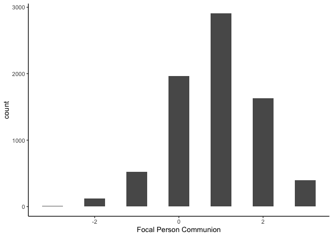
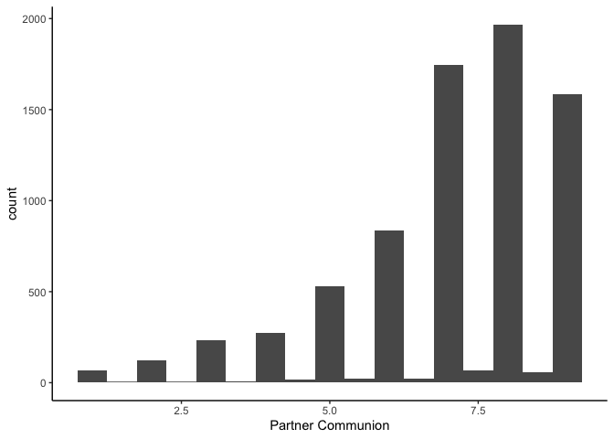
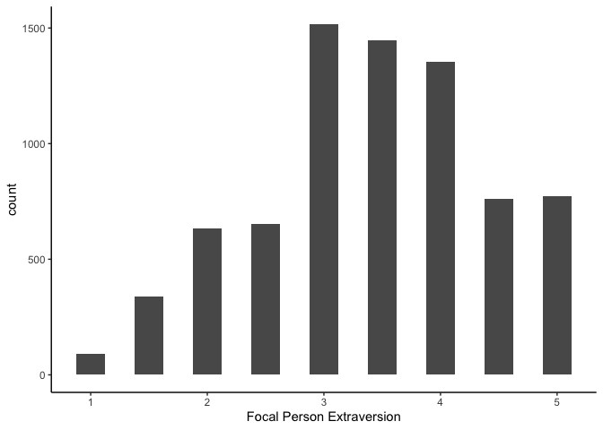
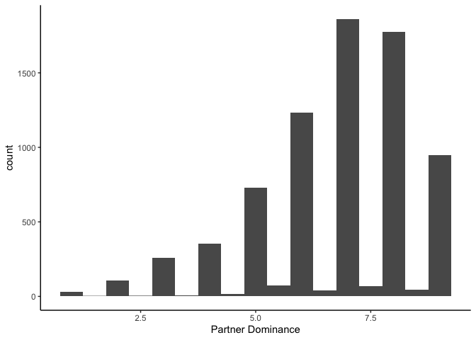
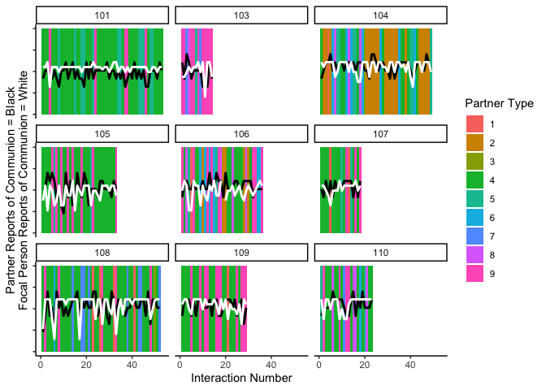
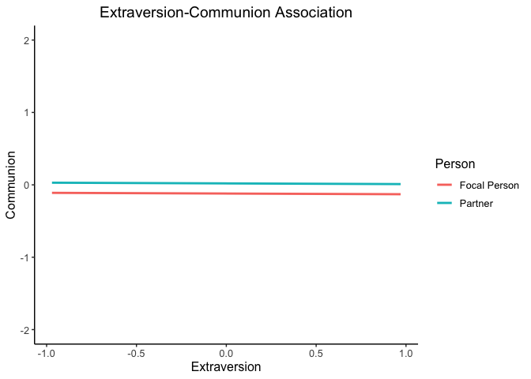

One-with-many (OWM) Tutorial
================
Miriam Brinberg

# Overview

The one-with-many (OWM) model (Kenny & Winquist, 2001; Kenny, Kashy, &
Cook, 2006, Chapter 10) is a dyadic analytic technique that exists in
the middle ground between the standard (APIM-type; [QuantDev APIM
Tutorial](https://quantdev.ssri.psu.edu/tutorials/actor-partner-interdependence-model-apim-basic-dyadicbivariate-analysis))
dyadic model and the social relations (round robin-type) model.

The OWM model was specifically constructed for and is used to examine
features of multiple dyadic relationships a set of focal persons (e.g.,
therapists, physicians) has with others (e.g., multiple clients,
patients). While this model was originally designed for and applied to
cross-sectional data, the model can be extended to accommodate and may
be particularly useful for the analysis of intensive repeated measures
data now being obtained through experience sampling and social media. A
more in-depth description and illustration of this model can be found in
Brinberg, Ram, Conroy, Pincus, and Gerstorf (under review).

In this tutorial, we will walk through two- and three-level OWM models
using the AMIB dataset - an experience sampling study of daily social
interactions, emotions, and behaviors from *N* = 190 college students.

# Outline

1.  Introduction to the Research Questions, Model, and Data.  
2.  Descriptives, Plotting, and Data preparation.  
3.  Two-level OWM model.  
4.  Three-level OWM model.
5.  Cautions and Conclusion.

# 1\. Introduction to the Research Questions, Model, and Data.

## The Research Questions.

We are going to address:

  - In the two-level model:
    
      - Is focal person extraversion associated with focal persons’ or
        partners’ reports of communion? This will be addressed by
        examining the fixed effects.
    
      - How much variability in communion (i.e., interpersonal warmth)
        reported after a social interaction is due to differences (1)
        between dyads within focal persons and (2) between focal
        persons? Stated differently, do focal persons view communion
        with their partners similarly and do partners view communion
        with their focal person similarly? These questions will be
        addressed by examining the random effects of the model.
    
      - Are there unique relationship effects between focal persons and
        partners - i.e., are there components of the relationship not
        accounted for by how the focal person views all of their
        partners and how all of the partners view the focal person? This
        will be addressed by examining the residual terms.

  - In the three-level model:
    
      - Is perceived partner dominance during an interaction associated
        with focal persons’ or partners’ reports of communion? This will
        be addressed by examining the fixed effects.
    
      - Is focal person extraversion associated with focal persons’ or
        partners’ reports of communion? Furthermore, does focal person
        extraversion moderate the association between perceptions of
        communion and dominance during a social interaction? This will
        be addressed by examining the fixed effects.
    
      - How much variability in communion (i.e., interpersonal warmth)
        reported after a social interaction is due to differences (1)
        within dyads, (2) between dyads within focal persons, and (3)
        between focal persons? Stated differently, do focal persons view
        communion with their partners similarly and do partners view
        communion with their focal person similarly? These questions
        will be addressed by examining the random effects of the model.
    
      - Are there unique relationship effects between focal persons and
        partners - i.e., are there components of the relationship not
        accounted for by how the focal person views all of their
        partners and how all of the partners view the focal person? This
        will be addressed by examining the residual terms.

## The Data.

The data are organized as follows:

  - We have one data set that contains person-level information
    collected at the baseline of the study. Since there are *N* (number
    of individuals) = 190 individuals, this data set will be 190 rows
    long.

  - We have another data set that contains interaction-level
    information. Each individual in the study reported on every
    interaction that lasted greater than five minutes, so we expect a
    varying number of reports per individual. In total, we have 7,568
    rows of data.

The data sets have additional columns we will not use, so we will subset
to only the variables we need. Specifically…

  - Participant ID (`id`)

  - Day (i.e., day in study; `day`)

  - Interaction (i.e., interaction number; `interaction`)

  - Partner type (i.e., categorical label for interaction partner,
    including friends, strangers, etc.; `partner_status`)

  - Big Five Inventory: Extraversion (`bfi_e`)

  - Partner communion (`igaff`)

  - Partner dominance (`igdom`)

  - Focal person communion (`sbi_commun`)

  - for a total of 8 columns in this data
set

### Before we begin, let’s load the libraries we need and data we are going to use.

``` r
library(dplyr)       #for data manipulation
library(fastDummies) #for creating dummy codes
library(ggplot2)     #for plotting
library(nlme)        #for mlm analysis
library(psych)       #for descriptives
library(reshape2)    #for data manipulation
```

Load the data.

``` r
# Set filepath for person-level data file
filepath <- "https://quantdev.ssri.psu.edu/sites/qdev/files/AMIBshare_persons_2019_0501.csv"

# Read in the .csv file using the url() function
amib_person <- read.csv(file = url(filepath), header = TRUE)

# Set filepath for interaction level data file
filepath1 <- "https://quantdev.ssri.psu.edu/sites/qdev/files/AMIBshare_interaction_2019_0501.csv" 

# Read in the .csv file using the url() function
amib_interaction <- read.csv(file = url(filepath1), header = TRUE)

# Merge daily and person-level data
amib <- merge(amib_person, amib_interaction, by = "id")
```

Subset to our variables of interest.

``` r
amib <- amib[ , c("id", "day", "interaction", "partner_status", 
                  "igaff", "igdom", "sbi_commun", "bfi_e")]
```

Create a variable within each partner type that counts the number of
interactions with that partner type.

``` r
amib <- amib %>%
        group_by(id, partner_status) %>%
        mutate(int_count = 1:(n())) %>%
        as.data.frame()

head(amib)
```

    ##    id day interaction partner_status igaff igdom sbi_commun bfi_e int_count
    ## 1 101   1           1             NA     7     6         -1   3.5         1
    ## 2 101   1           2              4     8     6          0   3.5         1
    ## 3 101   1           3              4     8     6          1   3.5         2
    ## 4 101   1           4              4     9     8          1   3.5         3
    ## 5 101   1           5              9     4     5          0   3.5         1
    ## 6 101   1           6              4     8     7          0   3.5         4

# 2\. Descriptives, Plotting, and Data Preparation.

### Descriptives.

Before beginning our analyses, it is often useful to get a feel for the
data we are working with. So, we start by describing the number of
social interactions for each participant and the number of social
interactions per day for each participant.

Number of social interactions per participant.

``` r
int_count <- amib %>%
             group_by(id) %>% 
             summarise(num_interactions = length(interaction)) %>%
             as.data.frame()

describe(int_count$num_interactions)
```

    ##    vars   n  mean    sd median trimmed   mad min max range  skew kurtosis se
    ## X1    1 184 41.13 13.62     43   42.45 17.79  10  56    46 -0.53    -0.94  1

On average, each participant had a total of 41.13 social interactions
(*SD* = 13.62) over the course of the eight-day study, ranging from a
minimum of 10 social interactions to a maximum of 56 social interactions
that lasted over five minutes.

Number of social interactions per person per day.

``` r
int_count_day <- amib %>%
                 group_by(id, day) %>%
                 summarise(num_interactions = length(interaction)) %>%
                 as.data.frame()

describe(int_count_day$num_interactions)
```

    ##    vars    n mean   sd median trimmed  mad min max range  skew kurtosis   se
    ## X1    1 1255 6.03 2.12      7    6.28 1.48   1   8     7 -0.63     -0.9 0.06

On average, each participant had a total of 6.03 social interactions
(*SD* = 2.12) each day over the course of the eight-day study, ranging
from a minimum of 1 social interactions to a maximum of 8 social
interactions each day that lasted over five minutes.

Next, let’s examine our outcome (*focal person communion* =
`sbi_commun`; *partner communion* = `igaff`) and predictor (*focal
person extraversion* = `bfi_e`; *partner dominance* = `igdom`)
variables.

``` r
#focal person communion
describe(amib$sbi_commun)
```

    ##    vars    n mean   sd median trimmed  mad min max range  skew kurtosis   se
    ## X1    1 7568 0.87 1.06      1     0.9 1.48  -3   3     6 -0.23      0.1 0.01

``` r
ggplot(data = amib, aes(x = sbi_commun)) + 
  geom_histogram(binwidth = 0.5) +
  xlab("Focal Person Communion") +
  theme_classic()
```

<!-- -->

``` r
#partner communion
describe(amib$igaff)
```

    ##    vars    n mean   sd median trimmed  mad min max range  skew kurtosis   se
    ## X1    1 7554 7.06 1.76      7    7.31 1.48   1   9     8 -1.16     1.11 0.02

``` r
ggplot(data = amib, aes(x = igaff)) + 
  geom_histogram(binwidth = 0.5) +
  xlab("Partner Communion") +
  theme_classic()
```

    ## Warning: Removed 14 rows containing non-finite values (stat_bin).

<!-- -->

``` r
#focal person extraversion
describe(amib$bfi_e)
```

    ##    vars    n mean   sd median trimmed  mad min max range  skew kurtosis   se
    ## X1    1 7568 3.41 0.97    3.5    3.43 0.74   1   5     4 -0.24    -0.52 0.01

``` r
ggplot(data = amib, aes(x = bfi_e)) + 
  geom_histogram(binwidth = 0.25) +
  xlab("Focal Person Extraversion") +
  theme_classic()
```

<!-- -->

``` r
#partner dominance
describe(amib$igdom)
```

    ##    vars    n mean   sd median trimmed  mad min max range  skew kurtosis   se
    ## X1    1 7553 6.74 1.67      7     6.9 1.48   1   9     8 -0.83     0.44 0.02

``` r
ggplot(data = amib, aes(x = igdom)) + 
  geom_histogram(binwidth = 0.5) +
  xlab("Partner Dominance") +
  theme_classic()
```

    ## Warning: Removed 15 rows containing non-finite values (stat_bin).

<!-- -->

### Data Preparation.

Currently, our data are in a “long” format (i.e., there is a single row
for each occasion in the data set). Because this data set was not
originally structured as a study of dyads, we are going to manipulate
our data in order to mimic dyadic data.

First, let’s double check the structure of our variables. We want to
make sure the “partner\_status” variable is a factor variable.

``` r
str(amib)
```

    ## 'data.frame':    7568 obs. of  9 variables:
    ##  $ id            : int  101 101 101 101 101 101 101 101 101 101 ...
    ##  $ day           : int  1 1 1 1 1 1 1 1 2 2 ...
    ##  $ interaction   : int  1 2 3 4 5 6 7 8 9 10 ...
    ##  $ partner_status: int  NA 4 4 4 9 4 4 4 5 4 ...
    ##  $ igaff         : num  7 8 8 9 4 8 8 8 7 8 ...
    ##  $ igdom         : num  6 6 6 8 5 7 7 7 6 7 ...
    ##  $ sbi_commun    : int  -1 0 1 1 0 0 1 0 -1 1 ...
    ##  $ bfi_e         : num  3.5 3.5 3.5 3.5 3.5 3.5 3.5 3.5 3.5 3.5 ...
    ##  $ int_count     : int  1 1 2 3 1 4 5 6 1 7 ...

Looks like we need to change “partner\_status” to a factor variable.

``` r
amib$partner_status <- as.factor(amib$partner_status)
```

We will also create dummy codes for the “partner\_status” variable,
which we will use in the three-level OWM model.

``` r
amib <- dummy_cols(amib, select_columns = c("partner_status"))
```

For the sake of this tutorial, remove rows in which information about
the partner is missing.

``` r
amib <- amib[complete.cases(amib[ , "partner_status"]),]
```

Then, we will have to re-do the interaction count (`int_count`) variable
to re-count the interactions now that we removed the missing data.

``` r
amib <- amib %>%
        group_by(id) %>%
        mutate(interaction = 1:length(interaction)) %>%
        as.data.frame()
```

Next, we’re going to do a bit of data management and “fudge” the data in
a way so it is dyadic.

Repeat each row twice, so we can have a row for each member of the
“dyad” at each interaction.

``` r
amib <- amib[rep(seq_len(nrow(amib)), each=2),]
```

Create variables to indicate whether the row is a focal person or
partner.  
Specifically:

  - focalcode = 1 if data are from the focal person and 0 if the data
    are from partner  
  - partcode = 1 if data are from partner and 0 if data are from the
    focal person

<!-- end list -->

``` r
even_indexes <- seq(2, nrow(amib), 2)
odd_indexes<-seq(1, nrow(amib) - 1, 2)

# Focal person
amib$focalcode <- 0
amib[odd_indexes, "focalcode"] <- 1

# Partner
amib$partcode <- 1
amib[odd_indexes, "partcode"] <- 0

head(amib)
```

    ##      id day interaction partner_status igaff igdom sbi_commun bfi_e int_count
    ## 1   101   1           1              4     8     6          0   3.5         1
    ## 1.1 101   1           1              4     8     6          0   3.5         1
    ## 2   101   1           2              4     8     6          1   3.5         2
    ## 2.1 101   1           2              4     8     6          1   3.5         2
    ## 3   101   1           3              4     9     8          1   3.5         3
    ## 3.1 101   1           3              4     9     8          1   3.5         3
    ##     partner_status_1 partner_status_2 partner_status_3 partner_status_4
    ## 1                  0                0                0                1
    ## 1.1                0                0                0                1
    ## 2                  0                0                0                1
    ## 2.1                0                0                0                1
    ## 3                  0                0                0                1
    ## 3.1                0                0                0                1
    ##     partner_status_5 partner_status_6 partner_status_7 partner_status_8
    ## 1                  0                0                0                0
    ## 1.1                0                0                0                0
    ## 2                  0                0                0                0
    ## 2.1                0                0                0                0
    ## 3                  0                0                0                0
    ## 3.1                0                0                0                0
    ##     partner_status_9 partner_status_NA focalcode partcode
    ## 1                  0                 0         1        0
    ## 1.1                0                 0         0        1
    ## 2                  0                 0         1        0
    ## 2.1                0                 0         0        1
    ## 3                  0                 0         1        0
    ## 3.1                0                 0         0        1

Self and partner communion are on different scales, so we will
standardize these for the sake of interpretation.

``` r
amib$self_comm <- scale(amib$igaff)
amib$partner_comm <- scale(amib$sbi_commun)
```

Extraversion (`bfi_e`) should be also centered before analysis so that
the intercept terms indicate expected value for an average person rather
than for a person with bfi\_e = 0 (who does not exist in the data).

``` r
amib$bfi_e_c <- scale(amib$bfi_e, center = TRUE, scale = FALSE)
```

Create a new outcome variable for communion, such that one column
alternates between self and partner reports of commuion. Make sure that
self communion reports are in rows where the focal person dummy variable
(`focalcode`) is equal to one, and that the partner communion reports
are in rows where the partner person dummy variable (`partcode`) is
equal to
one.

``` r
amib$communion[amib$focalcode == 1] <- amib$self_comm[amib$focalcode == 1]

amib$communion[amib$partcode == 1] <- amib$partner_comm[amib$partcode == 1]

head(amib)
```

    ##      id day interaction partner_status igaff igdom sbi_commun bfi_e int_count
    ## 1   101   1           1              4     8     6          0   3.5         1
    ## 1.1 101   1           1              4     8     6          0   3.5         1
    ## 2   101   1           2              4     8     6          1   3.5         2
    ## 2.1 101   1           2              4     8     6          1   3.5         2
    ## 3   101   1           3              4     9     8          1   3.5         3
    ## 3.1 101   1           3              4     9     8          1   3.5         3
    ##     partner_status_1 partner_status_2 partner_status_3 partner_status_4
    ## 1                  0                0                0                1
    ## 1.1                0                0                0                1
    ## 2                  0                0                0                1
    ## 2.1                0                0                0                1
    ## 3                  0                0                0                1
    ## 3.1                0                0                0                1
    ##     partner_status_5 partner_status_6 partner_status_7 partner_status_8
    ## 1                  0                0                0                0
    ## 1.1                0                0                0                0
    ## 2                  0                0                0                0
    ## 2.1                0                0                0                0
    ## 3                  0                0                0                0
    ## 3.1                0                0                0                0
    ##     partner_status_9 partner_status_NA focalcode partcode self_comm
    ## 1                  0                 0         1        0 0.5143292
    ## 1.1                0                 0         0        1 0.5143292
    ## 2                  0                 0         1        0 0.5143292
    ## 2.1                0                 0         0        1 0.5143292
    ## 3                  0                 0         1        0 1.0914917
    ## 3.1                0                 0         0        1 1.0914917
    ##     partner_comm    bfi_e_c  communion
    ## 1     -0.8317975 0.08693182  0.5143292
    ## 1.1   -0.8317975 0.08693182 -0.8317975
    ## 2      0.1119341 0.08693182  0.5143292
    ## 2.1    0.1119341 0.08693182  0.1119341
    ## 3      0.1119341 0.08693182  1.0914917
    ## 3.1    0.1119341 0.08693182  0.1119341

I think the data are ready for modeling\!

### Plotting.

Before modeling, it can also be helpful to plot the data to understand
between- and within-individual differences.

For a subset of participants, plot focal persons’ and partners’ reports
of communion over time across partner types.

``` r
ggplot() + 
  geom_rect(data = amib[which(amib$id < 111), ], 
            aes(xmin = interaction - .5, xmax = interaction + .5, ymin = -5, ymax = 5, 
                fill = as.factor(partner_status))) +
  geom_line(data = amib[which(amib$id < 111), ], aes(x = interaction, y = partner_comm), size = 1) +
  geom_line(data = amib[which(amib$id < 111), ], aes(x = interaction, y = self_comm), 
            color = "white", size = 1) +
  xlab("Interaction Number") +
  ylab("Partner Reports of Communion = Black\nFocal Person Reports of Communion = White") +
  facet_wrap( ~ id) +
  scale_fill_discrete(name="Partner Type") +
  theme_classic() +
  theme(axis.text.y=element_blank())
```

<!-- -->

# 3\. Two-level OWM model.

We’ll first construct a model examining differences in partners’ and
focal persons’ reports of communion (`communion`) by focal person
extraversion (`bfi_e`) - *not* distinguishing by partner type.

We use the two dummy variables (`focalcode` and `partcode`) to turn on
and off the parameters. The parameters invoked with

are associated with the focal persons’ reports of communion, and
parameters invoked with

are associated with the partners’ reports of communion.

Level 1 of the multilevel model is as follows:

  
  

And Level 2 of the multilevel model:   
  

Noting that our random effect matrices also expand,   
  

where
 is the residual covariance between focal person
and partner communion.  
and

  
![\\left\[\\begin{array}
{rrrr}
\\sigma^{2}\_{v0Fi} & \\sigma\_{v0Fiv0Pi} \\\\
\\sigma\_{v0Fiv0Pi} & \\sigma^{2}\_{v0Pi} \\\\
\\end{array}\\right\]](https://latex.codecogs.com/png.latex?%5Cleft%5B%5Cbegin%7Barray%7D%0A%7Brrrr%7D%0A%5Csigma%5E%7B2%7D_%7Bv0Fi%7D%20%26%20%5Csigma_%7Bv0Fiv0Pi%7D%20%5C%5C%0A%5Csigma_%7Bv0Fiv0Pi%7D%20%26%20%5Csigma%5E%7B2%7D_%7Bv0Pi%7D%20%5C%5C%0A%5Cend%7Barray%7D%5Cright%5D
"\\left[\\begin{array}
{rrrr}
\\sigma^{2}_{v0Fi} & \\sigma_{v0Fiv0Pi} \\\\
\\sigma_{v0Fiv0Pi} & \\sigma^{2}_{v0Pi} \\\\
\\end{array}\\right]")  

where the matrix is blocks of between-focal person associations. *These
are sample-level, between-dyad relations, and should be interpreted
appropriately.*

We are going to take a subset of our data to make cross-sectional data.
So, we’ll select the first social interaction with each partner type for
each participant.

``` r
two_level <- amib %>%
             group_by(id, partner_status) %>%
             filter(row_number() == 1 | row_number() == 2) %>%
             group_by(id) %>%
             mutate(measurement = rep(1:(n()/2), each = 2)) %>%
             as.data.frame()

head(two_level)
```

    ##    id day interaction partner_status igaff igdom sbi_commun bfi_e int_count
    ## 1 101   1           1              4     8     6          0   3.5         1
    ## 2 101   1           1              4     8     6          0   3.5         1
    ## 3 101   1           4              9     4     5          0   3.5         1
    ## 4 101   1           4              9     4     5          0   3.5         1
    ## 5 101   2           8              5     7     6         -1   3.5         1
    ## 6 101   2           8              5     7     6         -1   3.5         1
    ##   partner_status_1 partner_status_2 partner_status_3 partner_status_4
    ## 1                0                0                0                1
    ## 2                0                0                0                1
    ## 3                0                0                0                0
    ## 4                0                0                0                0
    ## 5                0                0                0                0
    ## 6                0                0                0                0
    ##   partner_status_5 partner_status_6 partner_status_7 partner_status_8
    ## 1                0                0                0                0
    ## 2                0                0                0                0
    ## 3                0                0                0                0
    ## 4                0                0                0                0
    ## 5                1                0                0                0
    ## 6                1                0                0                0
    ##   partner_status_9 partner_status_NA focalcode partcode   self_comm
    ## 1                0                 0         1        0  0.51432924
    ## 2                0                 0         0        1  0.51432924
    ## 3                1                 0         1        0 -1.79432077
    ## 4                1                 0         0        1 -1.79432077
    ## 5                0                 0         1        0 -0.06283326
    ## 6                0                 0         0        1 -0.06283326
    ##   partner_comm    bfi_e_c   communion measurement
    ## 1   -0.8317975 0.08693182  0.51432924           1
    ## 2   -0.8317975 0.08693182 -0.83179748           1
    ## 3   -0.8317975 0.08693182 -1.79432077           2
    ## 4   -0.8317975 0.08693182 -0.83179748           2
    ## 5   -1.7755290 0.08693182 -0.06283326           3
    ## 6   -1.7755290 0.08693182 -1.77552903           3

Now, we run our model of interest: examining differences in partners’
and focal persons’ reports of communion (`communion`) by focal person
extraversion (`bfi_e`) - *not* distinguishing by partner type.

``` r
ctrl <- lmeControl(opt='optim')

model_2level <- lme(fixed = communion ~ 
                                 -1 +
                                 focalcode + 
                                 partcode + 
                                 focalcode:bfi_e_c + 
                                 partcode:bfi_e_c,
                        random = ~ -1 + focalcode + partcode | id, #the -1 makes sure no intercept is estimated
                        weights = varIdent(form = ~1 | focalcode),
                        corr = corCompSymm(form = ~as.numeric(focalcode) | id/focalcode),
                        control = ctrl,
                        data = two_level,
                        na.action=na.exclude) 

summary(model_2level)
```

    ## Linear mixed-effects model fit by REML
    ##  Data: two_level 
    ##        AIC      BIC    logLik
    ##   4615.597 4669.192 -2297.799
    ## 
    ## Random effects:
    ##  Formula: ~-1 + focalcode + partcode | id
    ##  Structure: General positive-definite, Log-Cholesky parametrization
    ##           StdDev    Corr  
    ## focalcode 0.3236974 foclcd
    ## partcode  0.2709433 0.408 
    ## Residual  0.9494986       
    ## 
    ## Correlation Structure: Compound symmetry
    ##  Formula: ~as.numeric(focalcode) | id/focalcode 
    ##  Parameter estimate(s):
    ##         Rho 
    ## -0.04233659 
    ## Variance function:
    ##  Structure: Different standard deviations per stratum
    ##  Formula: ~1 | focalcode 
    ##  Parameter estimates:
    ##        0        1 
    ## 1.000000 1.099058 
    ## Fixed effects: communion ~ -1 + focalcode + partcode + focalcode:bfi_e_c + partcode:bfi_e_c 
    ##                         Value  Std.Error   DF    t-value p-value
    ## focalcode         -0.12377253 0.04226193 1388 -2.9287007  0.0035
    ## partcode           0.02047645 0.03741858 1388  0.5472268  0.5843
    ## focalcode:bfi_e_c -0.01485689 0.04261544 1388 -0.3486270  0.7274
    ## partcode:bfi_e_c  -0.01149355 0.03774054 1388 -0.3045411  0.7608
    ##  Correlation: 
    ##                   foclcd partcd fcl:__
    ## partcode          0.131               
    ## focalcode:bfi_e_c 0.043  0.005        
    ## partcode:bfi_e_c  0.005  0.044  0.127 
    ## 
    ## Standardized Within-Group Residuals:
    ##         Min          Q1         Med          Q3         Max 
    ## -3.25389432 -0.65321977  0.08885428  0.73307104  2.34815916 
    ## 
    ## Number of Observations: 1575
    ## Number of Groups: 184

#### Brief Interpretation of the Results

Going back to the original research questions outlined at the beginning
of the tutorial…

  - Is focal person extraversion associated with focal persons’ or
    partners’ reports of communion?
    
      - The association between focal persons’ extraversion and focal
        person reports of communion
        () is -0.01 and is not significantly different from
        zero. Furthermore, the association between focal persons’
        extraversion and partner reports of communion
        () is -0.01 and is not significantly different from
        zero.

  - How much variability in communion (i.e., interpersonal warmth)
    reported after a social interaction is due to differences (1)
    between dyads within focal persons and (2) between focal persons?
    Stated differently, do focal persons view communion with their
    partners similarly and do partners view communion with their focal
    person similarly?
    
      - The standard deviation around focal person
        () and partners
        () reports of communion is 0.32 and 0.27,
        respectively. Additionally, focal person and partners reports of
        communion are correlated 0.41, indicating that members of the
        same dyad often have relatively similar reports of communion.

  - Are there unique relationship effects between focal persons and
    partners - i.e., are there components of the relationship not
    accounted for by how the focal person views all of their partners
    and how all of the partners view the focal person?
    
      - The standard deviation around the focal person residual
        () is 0.95 and the standard deviation around the
        partner residual
        () is 1.04 (0.949 \* 1.099), indicating unique
        relationship effects.

#### Plotting the results.

Calculate estimates for focal persons and partners at +/- 1SD for
centered extraversion for focal persons and partners.

``` r
# Find -1 and +1 SD of extraversion
describe(amib$bfi_e_c)
```

    ##    vars     n mean   sd median trimmed  mad   min  max range  skew kurtosis
    ## X1    1 14080    0 0.97   0.09    0.02 0.74 -2.41 1.59     4 -0.23    -0.54
    ##      se
    ## X1 0.01

``` r
# Points at which to estimate communion
extraversion <- c(-0.97, 0, 0.97)

# Calculate communion for each focal person and partner +/- 1SD extraversion
fp_est <- -0.12 + -0.01*extraversion 

p_est <- 0.02 + -0.01*extraversion 

# Combine all of these into one vector
fit_estimates <- c(fp_est, p_est)
```

Build a data set that contains the predicted values.

``` r
# Focal person / partner label
focal_partner <- rep(c("Focal Person", "Partner"), each = 3)

# Extraversion levels
extraversion_repeat <- rep(c(-0.97, 0, 0.97), 2)

plot_data <- data.frame(focal_partner = focal_partner, extraversion = extraversion_repeat, fit_estimates)
```

Plot.

``` r
ggplot(plot_data, aes(x = extraversion, y = fit_estimates, 
                      color = focal_partner, group = focal_partner)) + 
    geom_line(size = 1) +
    labs(title = "Extraversion-Communion Association", 
         x = "Extraversion", y = "Communion", 
         color = "Person", fill = "Person", size = 12) + 
  ylim(-2, 2) +
  theme_classic() + 
  theme(text=element_text(size=12)) +
  theme(plot.title = element_text(hjust = 0.5))
```

<!-- -->

# 4\. Three-level OWM model.

Next, we are going to run the three-level OWM model which incorporates
the repeated measures for each partner type and allows us to examine
within-dyad processes. Specifically, we’ll construct a model examining
the focal person, partner, and relationship effects of communion during
social interactions with different types of partners (`partner_status`),
and whether the perceived partner dominance during the interaction
(`igdom`) or the extraversion of the focal person (`bfi_e`) were
associated with reports of communion (`communion`).

We use the two dummy variables (`focalcode` and `partcode`) to turn on
and off the parameters. The parameters invoked with

are associated with the focal persons’ reports of communion, and
parameters invoked with

are associated with the partners’ reports of communion. We also recast
`partner_status` as a set of 8 dummy variables (`partner_status_2`
through `partner_status_9`). The `partner_status` equal to 1 was used as
the reference category, and the model parameters associated with the 8
dummy variables represent deviations for each partner type from the
`partner_status` equal to 1 type.

Level 1 of the multilevel model is as follows:

  
  

And Level 2 of the multilevel model:

  
  
  
  
  
  
  
  
  
  

Finally, Level 3 of the multilevel model:

  
  
  
  
  
  
  
  
  
  
  
  
  
  
  
  
  
  
  
  
  
  
  
  
  
  
  
  
  
  

Finally, the covariance structure of the three-level OWM model follows
the same pattern as the random effects structure presented for the
two-level OWM model, except there is an additional 4 x 4 matrix that
contains the variances and covariances of the random effects at the
third level.

Examining the focal person, partner, and relationship effects of
communion during social interactions with different types of partners,
and whether the perceived partner dominance during the interaction or
the extraversion of the focal person were associated with reports of
communion.

``` r
ctrl <- lmeControl(opt='optim')

model_3level <- lme(fixed = communion ~ 
                            -1 +
                            focalcode + partcode +
                            focalcode:igdom + partcode:igdom + 
                            focalcode:bfi_e_c + partcode:bfi_e_c +
                            focalcode:igdom:bfi_e_c + partcode:igdom:bfi_e_c + 
                      
                            focalcode:partner_status_2 + partcode:partner_status_2 +
                            focalcode:partner_status_3 + partcode:partner_status_3 +
                            focalcode:partner_status_4 + partcode:partner_status_4 +
                            focalcode:partner_status_5 + partcode:partner_status_5 +
                            focalcode:partner_status_6 + partcode:partner_status_6 +
                            focalcode:partner_status_7 + partcode:partner_status_7 +
                            focalcode:partner_status_8 + partcode:partner_status_8 +
                            focalcode:partner_status_9 + partcode:partner_status_9 +
                      
                            focalcode:partner_status_2:igdom + partcode:partner_status_2:igdom +
                            focalcode:partner_status_3:igdom + partcode:partner_status_3:igdom +
                            focalcode:partner_status_4:igdom + partcode:partner_status_4:igdom +
                            focalcode:partner_status_5:igdom + partcode:partner_status_5:igdom +
                            focalcode:partner_status_6:igdom + partcode:partner_status_6:igdom +
                            focalcode:partner_status_7:igdom + partcode:partner_status_7:igdom +
                            focalcode:partner_status_8:igdom + partcode:partner_status_8:igdom +
                            focalcode:partner_status_9:igdom + partcode:partner_status_9:igdom +
                      
                            focalcode:partner_status_2:bfi_e_c + partcode:partner_status_2:bfi_e_c +
                            focalcode:partner_status_3:bfi_e_c + partcode:partner_status_3:bfi_e_c +
                            focalcode:partner_status_4:bfi_e_c + partcode:partner_status_4:bfi_e_c +
                            focalcode:partner_status_5:bfi_e_c + partcode:partner_status_5:bfi_e_c +
                            focalcode:partner_status_6:bfi_e_c + partcode:partner_status_6:bfi_e_c +
                            focalcode:partner_status_7:bfi_e_c + partcode:partner_status_7:bfi_e_c +
                            focalcode:partner_status_8:bfi_e_c + partcode:partner_status_8:bfi_e_c +
                            focalcode:partner_status_9:bfi_e_c + partcode:partner_status_9:bfi_e_c +
                      
                            focalcode:partner_status_2:igdom:bfi_e_c + partcode:partner_status_2:igdom:bfi_e_c +
                            focalcode:partner_status_3:igdom:bfi_e_c + partcode:partner_status_3:igdom:bfi_e_c +
                            focalcode:partner_status_4:igdom:bfi_e_c + partcode:partner_status_4:igdom:bfi_e_c +
                            focalcode:partner_status_5:igdom:bfi_e_c + partcode:partner_status_5:igdom:bfi_e_c +
                            focalcode:partner_status_6:igdom:bfi_e_c + partcode:partner_status_6:igdom:bfi_e_c +
                            focalcode:partner_status_7:igdom:bfi_e_c + partcode:partner_status_7:igdom:bfi_e_c +
                            focalcode:partner_status_8:igdom:bfi_e_c + partcode:partner_status_8:igdom:bfi_e_c +
                            focalcode:partner_status_9:igdom:bfi_e_c + partcode:partner_status_9:igdom:bfi_e_c,
                        random = ~ -1 + focalcode + partcode +
                                        focalcode:igdom + partcode:igdom | id/partner_status, 
                        weights = varIdent(form = ~1 | focalcode),
                        corr = corCompSymm(form = ~as.numeric(focalcode) | id/partner_status),
                        control = ctrl,
                        data = amib,
                        na.action = na.exclude) 

#summary(model_3level)

# Fixed Effects
summary(model_3level)$tTable
```

    ##                                                 Value  Std.Error    DF
    ## focalcode                                -0.691902706 0.36655434 13193
    ## partcode                                 -0.090677833 0.33252993 13193
    ## focalcode:igdom                           0.039132308 0.05007862 13193
    ## partcode:igdom                           -0.001704396 0.04506358 13193
    ## focalcode:bfi_e_c                         0.434478600 0.35063774 13193
    ## partcode:bfi_e_c                          0.407009627 0.30435589 13193
    ## focalcode:partner_status_2               -0.185232089 0.55948875 13193
    ## partcode:partner_status_2                 0.327897025 0.47998965 13193
    ## focalcode:partner_status_3               -0.081882122 1.34230334 13193
    ## partcode:partner_status_3                 0.207397406 1.37996826 13193
    ## focalcode:partner_status_4               -0.208352774 0.37715546 13193
    ## partcode:partner_status_4                -0.123238940 0.33846935 13193
    ## focalcode:partner_status_5               -0.137595827 0.40379462 13193
    ## partcode:partner_status_5                -0.051188717 0.36273300 13193
    ## focalcode:partner_status_6               -0.918697490 0.43076967 13193
    ## partcode:partner_status_6                -0.617463921 0.37951888 13193
    ## focalcode:partner_status_7               -0.258796973 0.59931777 13193
    ## partcode:partner_status_7                -0.091425961 0.53666988 13193
    ## focalcode:partner_status_8               -0.430351652 0.65303658 13193
    ## partcode:partner_status_8                 0.259815068 0.60295172 13193
    ## focalcode:partner_status_9               -0.685630341 0.38884960 13193
    ## partcode:partner_status_9                -0.287198374 0.34880846 13193
    ## focalcode:igdom:bfi_e_c                  -0.081562187 0.04760756 13193
    ## partcode:igdom:bfi_e_c                   -0.060633594 0.04104292 13193
    ## focalcode:igdom:partner_status_2          0.068007714 0.08022156 13193
    ## partcode:igdom:partner_status_2          -0.041291798 0.06865947 13193
    ## focalcode:igdom:partner_status_3         -0.039384803 0.17724281 13193
    ## partcode:igdom:partner_status_3          -0.034863443 0.17935826 13193
    ## focalcode:igdom:partner_status_4          0.103019015 0.05157272 13193
    ## partcode:igdom:partner_status_4           0.041702129 0.04588623 13193
    ## focalcode:igdom:partner_status_5          0.061167021 0.05594326 13193
    ## partcode:igdom:partner_status_5           0.014305055 0.05012603 13193
    ## focalcode:igdom:partner_status_6          0.215111790 0.05944744 13193
    ## partcode:igdom:partner_status_6           0.104706792 0.05198555 13193
    ## focalcode:igdom:partner_status_7          0.084184110 0.08132932 13193
    ## partcode:igdom:partner_status_7           0.031027434 0.07245150 13193
    ## focalcode:igdom:partner_status_8          0.147255276 0.09039798 13193
    ## partcode:igdom:partner_status_8          -0.012753986 0.08305072 13193
    ## focalcode:igdom:partner_status_9          0.144361935 0.05364501 13193
    ## partcode:igdom:partner_status_9           0.034092913 0.04779703 13193
    ## focalcode:bfi_e_c:partner_status_2       -0.307216764 0.55131608 13193
    ## partcode:bfi_e_c:partner_status_2        -0.695113226 0.46466794 13193
    ## focalcode:bfi_e_c:partner_status_3        2.899872529 1.42779328 13193
    ## partcode:bfi_e_c:partner_status_3        -0.434248184 1.41904562 13193
    ## focalcode:bfi_e_c:partner_status_4       -0.241279257 0.36125490 13193
    ## partcode:bfi_e_c:partner_status_4        -0.202908098 0.31040920 13193
    ## focalcode:bfi_e_c:partner_status_5       -0.043652090 0.38891877 13193
    ## partcode:bfi_e_c:partner_status_5        -0.151280485 0.33945328 13193
    ## focalcode:bfi_e_c:partner_status_6       -0.760185605 0.43029656 13193
    ## partcode:bfi_e_c:partner_status_6        -0.374291400 0.36338177 13193
    ## focalcode:bfi_e_c:partner_status_7       -0.072484741 0.65152120 13193
    ## partcode:bfi_e_c:partner_status_7        -0.819693749 0.59306174 13193
    ## focalcode:bfi_e_c:partner_status_8       -1.270841792 0.64642193 13193
    ## partcode:bfi_e_c:partner_status_8        -0.159320182 0.58466332 13193
    ## focalcode:bfi_e_c:partner_status_9       -0.224532005 0.37720032 13193
    ## partcode:bfi_e_c:partner_status_9        -0.216174795 0.32407625 13193
    ## focalcode:igdom:bfi_e_c:partner_status_2  0.080159664 0.08072751 13193
    ## partcode:igdom:bfi_e_c:partner_status_2   0.121141715 0.06890722 13193
    ## focalcode:igdom:bfi_e_c:partner_status_3 -0.411006790 0.18991244 13193
    ## partcode:igdom:bfi_e_c:partner_status_3   0.086616264 0.18694825 13193
    ## focalcode:igdom:bfi_e_c:partner_status_4  0.053326156 0.04915328 13193
    ## partcode:igdom:bfi_e_c:partner_status_4   0.030156415 0.04194483 13193
    ## focalcode:igdom:bfi_e_c:partner_status_5  0.007334003 0.05383290 13193
    ## partcode:igdom:bfi_e_c:partner_status_5   0.017219574 0.04700452 13193
    ## focalcode:igdom:bfi_e_c:partner_status_6  0.143743258 0.05948005 13193
    ## partcode:igdom:bfi_e_c:partner_status_6   0.067244554 0.05006303 13193
    ## focalcode:igdom:bfi_e_c:partner_status_7  0.052757545 0.08869164 13193
    ## partcode:igdom:bfi_e_c:partner_status_7   0.099018292 0.08048520 13193
    ## focalcode:igdom:bfi_e_c:partner_status_8  0.204378808 0.08911038 13193
    ## partcode:igdom:bfi_e_c:partner_status_8   0.010474603 0.08037425 13193
    ## focalcode:igdom:bfi_e_c:partner_status_9  0.051590016 0.05189775 13193
    ## partcode:igdom:bfi_e_c:partner_status_9   0.038102367 0.04434399 13193
    ##                                              t-value      p-value
    ## focalcode                                -1.88758564 0.0591035273
    ## partcode                                 -0.27269074 0.7850952214
    ## focalcode:igdom                           0.78141744 0.4345710367
    ## partcode:igdom                           -0.03782204 0.9698301422
    ## focalcode:bfi_e_c                         1.23910963 0.2153269427
    ## partcode:bfi_e_c                          1.33728192 0.1811536866
    ## focalcode:partner_status_2               -0.33107384 0.7405939682
    ## partcode:partner_status_2                 0.68313353 0.4945344643
    ## focalcode:partner_status_3               -0.06100121 0.9513591730
    ## partcode:partner_status_3                 0.15029143 0.8805369901
    ## focalcode:partner_status_4               -0.55243208 0.5806617186
    ## partcode:partner_status_4                -0.36410665 0.7157842069
    ## focalcode:partner_status_5               -0.34075696 0.7332919808
    ## partcode:partner_status_5                -0.14111955 0.8877776542
    ## focalcode:partner_status_6               -2.13268845 0.0329686997
    ## partcode:partner_status_6                -1.62696495 0.1037684230
    ## focalcode:partner_status_7               -0.43181929 0.6658798133
    ## partcode:partner_status_7                -0.17035791 0.8647312802
    ## focalcode:partner_status_8               -0.65900083 0.5099067353
    ## partcode:partner_status_8                 0.43090526 0.6665442986
    ## focalcode:partner_status_9               -1.76322760 0.0778852560
    ## partcode:partner_status_9                -0.82336986 0.4103125801
    ## focalcode:igdom:bfi_e_c                  -1.71321905 0.0866957422
    ## partcode:igdom:bfi_e_c                   -1.47732180 0.1396132683
    ## focalcode:igdom:partner_status_2          0.84774855 0.3965934018
    ## partcode:igdom:partner_status_2          -0.60139993 0.5475839797
    ## focalcode:igdom:partner_status_3         -0.22220818 0.8241552640
    ## partcode:igdom:partner_status_3          -0.19437880 0.8458822851
    ## focalcode:igdom:partner_status_4          1.99754850 0.0457861288
    ## partcode:igdom:partner_status_4           0.90881569 0.3634640259
    ## focalcode:igdom:partner_status_5          1.09337605 0.2742486889
    ## partcode:igdom:partner_status_5           0.28538175 0.7753561647
    ## focalcode:igdom:partner_status_6          3.61852091 0.0002973991
    ## partcode:igdom:partner_status_6           2.01415177 0.0440138596
    ## focalcode:igdom:partner_status_7          1.03510162 0.3006404280
    ## partcode:igdom:partner_status_7           0.42825113 0.6684752882
    ## focalcode:igdom:partner_status_8          1.62896647 0.1033439920
    ## partcode:igdom:partner_status_8          -0.15356864 0.8779522123
    ## focalcode:igdom:partner_status_9          2.69105993 0.0071315155
    ## partcode:igdom:partner_status_9           0.71328512 0.4756819569
    ## focalcode:bfi_e_c:partner_status_2       -0.55724253 0.5773711915
    ## partcode:bfi_e_c:partner_status_2        -1.49593542 0.1346944044
    ## focalcode:bfi_e_c:partner_status_3        2.03101707 0.0422732721
    ## partcode:bfi_e_c:partner_status_3        -0.30601425 0.7595986237
    ## focalcode:bfi_e_c:partner_status_4       -0.66789200 0.5042142208
    ## partcode:bfi_e_c:partner_status_4        -0.65367940 0.5133297706
    ## focalcode:bfi_e_c:partner_status_5       -0.11223961 0.9106351344
    ## partcode:bfi_e_c:partner_status_5        -0.44565922 0.6558507376
    ## focalcode:bfi_e_c:partner_status_6       -1.76665506 0.0773091320
    ## partcode:bfi_e_c:partner_status_6        -1.03002250 0.3030183283
    ## focalcode:bfi_e_c:partner_status_7       -0.11125462 0.9114161354
    ## partcode:bfi_e_c:partner_status_7        -1.38213898 0.1669524305
    ## focalcode:bfi_e_c:partner_status_8       -1.96596329 0.0493237892
    ## partcode:bfi_e_c:partner_status_8        -0.27249902 0.7852426085
    ## focalcode:bfi_e_c:partner_status_9       -0.59525931 0.5516803583
    ## partcode:bfi_e_c:partner_status_9        -0.66704918 0.5047523834
    ## focalcode:igdom:bfi_e_c:partner_status_2  0.99296585 0.3207448080
    ## partcode:igdom:bfi_e_c:partner_status_2   1.75804099 0.0787637212
    ## focalcode:igdom:bfi_e_c:partner_status_3 -2.16419102 0.0304675754
    ## partcode:igdom:bfi_e_c:partner_status_3   0.46331679 0.6431449562
    ## focalcode:igdom:bfi_e_c:partner_status_4  1.08489509 0.2779879468
    ## partcode:igdom:bfi_e_c:partner_status_4   0.71895432 0.4721818010
    ## focalcode:igdom:bfi_e_c:partner_status_5  0.13623645 0.8916364377
    ## partcode:igdom:bfi_e_c:partner_status_5   0.36633867 0.7141182531
    ## focalcode:igdom:bfi_e_c:partner_status_6  2.41666347 0.0156769714
    ## partcode:igdom:bfi_e_c:partner_status_6   1.34319798 0.1792309809
    ## focalcode:igdom:bfi_e_c:partner_status_7  0.59484236 0.5519590523
    ## partcode:igdom:bfi_e_c:partner_status_7   1.23026711 0.2186190336
    ## focalcode:igdom:bfi_e_c:partner_status_8  2.29354662 0.0218322010
    ## partcode:igdom:bfi_e_c:partner_status_8   0.13032286 0.8963129785
    ## focalcode:igdom:bfi_e_c:partner_status_9  0.99407029 0.3202068807
    ## partcode:igdom:bfi_e_c:partner_status_9   0.85924533 0.3902207907

``` r
# Random Effects
VarCorr(model_3level)
```

    ##                  Variance                                                               
    ## id =             pdLogChol(-1 + focalcode + partcode + focalcode:igdom + partcode:igdom)
    ## focalcode        0.942560409                                                            
    ## partcode         0.308426605                                                            
    ## focalcode:igdom  0.019083344                                                            
    ## partcode:igdom   0.005163955                                                            
    ## partner_status = pdLogChol(-1 + focalcode + partcode + focalcode:igdom + partcode:igdom)
    ## focalcode        1.296866716                                                            
    ## partcode         0.134896950                                                            
    ## focalcode:igdom  0.026215636                                                            
    ## partcode:igdom   0.001776765                                                            
    ## Residual         0.618586720                                                            
    ##                  StdDev     Corr                
    ## id =                                            
    ## focalcode        0.97085550 foclcd partcd fclcd:
    ## partcode         0.55536169  0.449              
    ## focalcode:igdom  0.13814248 -0.945 -0.539       
    ## partcode:igdom   0.07186067 -0.589 -0.822  0.703
    ## partner_status =                                
    ## focalcode        1.13880056 foclcd partcd fclcd:
    ## partcode         0.36728320  0.792              
    ## focalcode:igdom  0.16191243 -0.964 -0.630       
    ## partcode:igdom   0.04215169 -0.921 -0.806  0.903
    ## Residual         0.78650284

#### Brief Interpretation of the Results

Going back to the original research questions outlined at the beginning
of the tutorial…

  - Is perceived partner dominance during an interaction associated with
    focal persons’ or partners’ reports of communion?
    
      - The association between focal person communion and partner
        dominance during an interaction is not significant for the
        reference partner type, but this association varies by partner
        type. For some dyads, this association is significantly
        different than the reference category (e.g., partner type 4),
        whereas for other dyads, this association is not significantly
        different than the reference category (e.g., partner type 3).
    
      - The association between partner communion and partner dominance
        during an interaction is not significant for the reference
        partner type, but this association varies by partner type. For
        some dyads, this association is significantly different than the
        reference category (e.g., partner type 6), whereas for other
        dyads, this association is not significantly different than the
        reference category (e.g., partner type 3).

  - Is focal person extraversion associated with focal persons’ or
    partners’ reports of communion? Furthermore, does focal person
    extraversion moderate the association between perceptions of
    communion and dominance during a social interaction?
    
      - The association between focal person communion and focal person
        extraversion is not significant for the reference partner type,
        but this association varies by partner type. depends. For some
        dyads, this association is significantly different than the
        reference category (e.g., partner type 3), whereas for other
        dyads, this association is not significantly different than the
        reference category (e.g., partner type 2).
    
      - The association between partner communion and focal person
        extraversion is not significant for the reference partner type,
        and this association does not significantly differ for any
        partner type from the reference category.
    
      - The moderation of focal person extraversion on the association
        between communion and focal person dominance during an
        interaction is not significant for the reference partner type,
        but this association varies by partner type. For some focal
        person-partner dyads, this association is significantly
        different than the reference category (e.g., partner type 3),
        whereas for other dyads, this association is not significantly
        different than the reference category for some partner-focal
        person dyads (e.g., partner type 4).

  - How much variability in communion (i.e., interpersonal warmth)
    reported after a social interaction is due to differences (1) within
    dyads, (2) between dyads within focal persons, and (3) between focal
    persons? Stated differently, do focal persons view communion with
    their partners similarly and do partners view communion with their
    focal person similarly?
    
      - The standard deviation around focal person
        () and partners
        () reports of communion *between focal persons*
        is 0.97 and 0.55, respectively. The standard deviation around
        focal person
        () and partners
        () reports of communion *between partners within
        focal persons* is 1.14 and 0.37, respectively.
    
      - Focal persons’ and partners’ reports of communion *between focal
        persons* are correlated 0.45, indicating that members of the
        same dyad often have unrelated reports of communion. The
        correlation between focal persons’ and partners’ reports of
        communion *within a focal person* is 0.79, indicating that
        within a focal person, focal persons in a dyad who reported
        higher levels of communion than average had partners who also
        reported higher levels of communion than average.

  - Are there unique relationship effects between focal persons and
    partners - i.e., are there components of the relationship not
    accounted for by how the focal person views all of their partners
    and how all of the partners view the focal person?
    
      - The standard deviation around the focal person residual
        () is 0.79 and the standard deviation around the
        partner residual
        () is 0.91 (0.786 \* 1.162), indicating unique
        relationship effects.

# 5\. Cautions and Conclusion.

While our model took into account the nesting of repeated measures
within partner and within focal person, we did not consider time in our
model. For example, we could’ve allowed for auto-correlated errors
between time points, as there might have been carry-over from one social
interaction to the next. Furthermore, we assume that there has been no
change in the outcome variable (i.e., communion) over the course of the
study - i.e., that there have been no reactivity effects to the study.

In sum, this tutorial demostrated how to run a two-level OWM model with
“cross-sectional” data and extend the model to three-levels for
repeated measures data. While we used data from an experience sampling
study for this example, we believe this model has a wide variety of
applications to various data sources, such as data collected from social
media (i.e., when full network information is not available).
